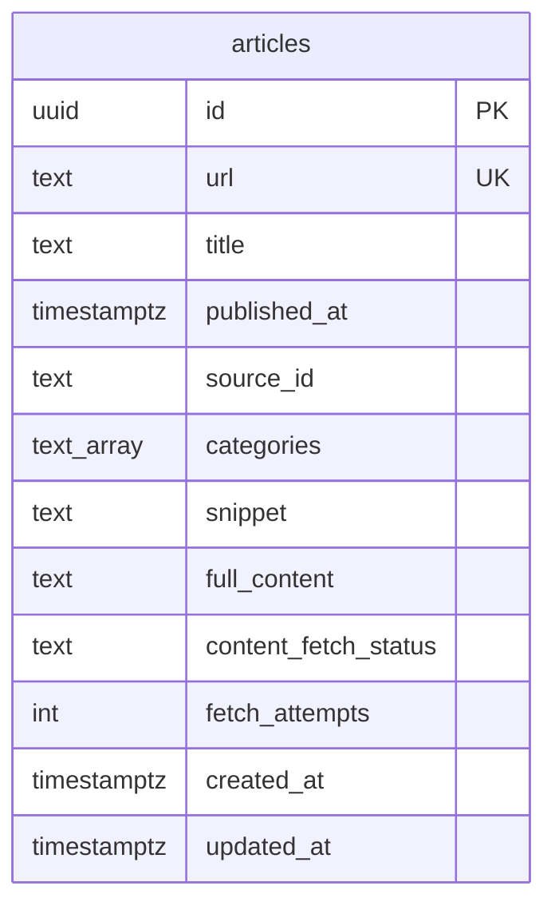

# RSS Ingestion — Database Schema

**Ngày:** 2026-08-20
**Trạng thái:** Đang chạy production (Supabase project "Social Listening ver 2", region ap-southeast-2)
**Thuộc:** chi tiết hoá phần data model của [2026-08-20-rss-ingestion-design.md](./2026-08-20-rss-ingestion-design.md) §3, phản ánh đúng migration đã apply thực tế (`supabase/migrations/0001_create_articles_table.sql`), không phải bản dự kiến lúc viết spec.

## Sơ đồ

Hiện tại chỉ có **1 bảng duy nhất** — `articles`. Các sub-project sau (Apify, trend computation) sẽ thêm bảng mới; sơ đồ này sẽ mở rộng khi đó.

## Chi tiết cột

| Cột | Kiểu | Ràng buộc | Ghi chú |
|---|---|---|---|
| `id` | `uuid` | PK, `default gen_random_uuid()` | tự sinh, không truyền lúc insert |
| `url` | `text` | `not null unique` | key dedup — `upsertArticle` dùng `onConflict: 'url', ignoreDuplicates: true`, nên bài trùng URL **không bị ghi đè** |
| `title` | `text` | `not null` | |
| `published_at` | `timestamptz` | nullable | RSS feed lỗi/thiếu ngày vẫn ingest được; code tầng app hiện luôn backfill `new Date().toISOString()` nếu feed thiếu, nên cột null trên thực tế hiếm khi xảy ra |
| `source_id` | `text` | `not null` | **không phải FK trong DB** — trỏ tới `id` trong `config/sources.config.ts` (12 feed). Cố tình không dùng bảng nguồn riêng, giữ đúng nguyên tắc "category/source source-of-truth nằm trong repo, không phải DB" |
| `categories` | `text[]` | `not null default '{}'` | multi-category; tính 2 lần — lúc ingest (từ title+snippet) và tính lại lúc crawl xong (từ `full_content`, **union** với giá trị cũ, không bao giờ mất category — xem commit `e740cef`) |
| `snippet` | `text` | `not null default ''` | mô tả ngắn lấy thẳng từ RSS |
| `full_content` | `text` | nullable | do job `crawl-content` điền; **hiện đang là HTML thô** chưa strip tag (known gap) |
| `content_fetch_status` | `text` | `not null default 'pending'`, `check in ('pending','done','failed')` | cơ chế handoff duy nhất giữa 2 job `ingest-rss` → `crawl-content`, không dùng queue service riêng |
| `fetch_attempts` | `integer` | `not null default 0` | tăng mỗi lần crawl thử; đạt `MAX_FETCH_ATTEMPTS = 3` thì `content_fetch_status` khoá vĩnh viễn ở `failed`, không retry vô hạn |
| `created_at` | `timestamptz` | `not null default now()` | |
| `updated_at` | `timestamptz` | `not null default now()` | **không có trigger** — cột này hiện không bao giờ được cập nhật sau lần insert đầu (known gap) |

## Index

- `articles_content_fetch_status_idx` — btree trên `content_fetch_status`, phục vụ query `getPendingArticles` (lọc `= 'pending'`) chạy mỗi lần job `crawl-content` khởi động.
- `articles_categories_idx` — GIN trên `categories`, phục vụ query lọc theo category (dashboard tương lai — `overall` = không lọc, 3 category còn lại = `categories @> ARRAY['tai_chinh']` kiểu tương tự).

## Row Level Security

`alter table articles enable row level security;` — **bật nhưng chưa có policy nào**. An toàn ở giai đoạn hiện tại vì toàn bộ ghi/đọc đều qua `service_role` key (bypass RLS) trong GitHub Actions; chặn hoàn toàn mọi truy cập qua `anon`/`publishable` key cho tới khi có policy — cần nhớ thêm policy nếu sau này dashboard (sub-project 4) đọc trực tiếp từ Supabase bằng key public.

## Nguồn RSS (`config/sources.config.ts`) — 5 báo × 3 danh mục = 15 feed

Đây là toàn bộ nguồn ghi vào `source_id`/`categories` của bảng `articles`. Danh sách này verify live lần cuối 2026-08-20 — báo có thể đổi đường dẫn feed theo thời gian, cần re-check nếu một nguồn tự nhiên trả về 0 bài.

| Nguồn | tài chính | giải trí | du lịch |
|---|---|---|---|
| VnExpress | [/rss/kinh-doanh.rss](https://vnexpress.net/rss/kinh-doanh.rss) | [/rss/giai-tri.rss](https://vnexpress.net/rss/giai-tri.rss) | [/rss/du-lich.rss](https://vnexpress.net/rss/du-lich.rss) |
| Dân Trí | [/rss/kinh-doanh.rss](https://dantri.com.vn/rss/kinh-doanh.rss) | [/rss/giai-tri.rss](https://dantri.com.vn/rss/giai-tri.rss) | [/rss/du-lich.rss](https://dantri.com.vn/rss/du-lich.rss) |
| Thanh Niên | [/rss/kinh-te.rss](https://thanhnien.vn/rss/kinh-te.rss) | [/rss/giai-tri.rss](https://thanhnien.vn/rss/giai-tri.rss) | [/rss/du-lich.rss](https://thanhnien.vn/rss/du-lich.rss) |
| Tuổi Trẻ | [/rss/kinh-doanh.rss](https://tuoitre.vn/rss/kinh-doanh.rss) | [/rss/giai-tri.rss](https://tuoitre.vn/rss/giai-tri.rss) | [/rss/du-lich.rss](https://tuoitre.vn/rss/du-lich.rss) |
| VietNamNet | [/rss/kinh-doanh.rss](https://vietnamnet.vn/rss/kinh-doanh.rss) | [/rss/giai-tri.rss](https://vietnamnet.vn/rss/giai-tri.rss) | [/rss/du-lich.rss](https://vietnamnet.vn/rss/du-lich.rss) |

**Đã kiểm tra nhưng không thêm:** Báo Mới (baomoi.com) — không tìm thấy RSS feed nào sau khi thử các pattern phổ biến; ngoài ra đây là trang tổng hợp (re-publish lại nội dung từ các báo gốc, bao gồm cả 4 nguồn đã có sẵn ở trên), nên dù có feed cũng dễ gây trùng lặp nội dung.

## Known gaps liên quan tới schema này (chưa xử lý, xem [[project_rss_ingestion_subproject]])

- `updated_at` không có trigger tự cập nhật.
- `full_content` lưu HTML thô, tên cột gây hiểu nhầm là plain text.
- Lỗi ghi (`markDone`/`markRetryOrFailed`) bị nuốt thầm ở tầng `SupabaseArticleRepository` — không liên quan schema nhưng ảnh hưởng trực tiếp độ tin cậy dữ liệu trong bảng này.
