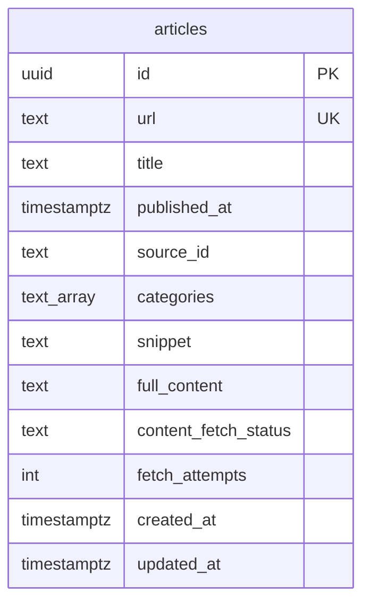

# RSS Ingestion — Database Schema

**Ngày:** 2026-08-20
**Trạng thái:** Đang chạy production (Supabase project "Social Listening ver 2", region ap-southeast-2)
**Thuộc:** chi tiết hoá phần data model của [2026-08-20-rss-ingestion-design.md](./2026-08-20-rss-ingestion-design.md) §3, phản ánh đúng migration đã apply thực tế (`supabase/migrations/0001_create_articles_table.sql`), không phải bản dự kiến lúc viết spec.

## Sơ đồ

Hiện tại chỉ có **1 bảng duy nhất** — `articles`. Các sub-project sau (Apify, trend computation) sẽ thêm bảng mới; sơ đồ này sẽ mở rộng khi đó.

## Chi tiết cột

| Cột | Kiểu | Ràng buộc | Ghi chú |
|---|---|---|---|
| `id` | `uuid` | PK, `default gen_random_uuid()` | tự sinh, không truyền lúc insert |
| `url` | `text` | `not null unique` | key dedup — `upsertArticle` dùng `onConflict: 'url', ignoreDuplicates: true`, nên bài trùng URL **không bị ghi đè** |
| `title` | `text` | `not null` | |
| `published_at` | `timestamptz` | nullable | RSS feed lỗi/thiếu ngày vẫn ingest được; code tầng app hiện luôn backfill `new Date().toISOString()` nếu feed thiếu, nên cột null trên thực tế hiếm khi xảy ra |
| `source_id` | `text` | `not null` | **không phải FK trong DB** — trỏ tới `id` trong `config/sources.config.ts` (26 feed). Cố tình không dùng bảng nguồn riêng, giữ đúng nguyên tắc "category/source source-of-truth nằm trong repo, không phải DB" |
| `categories` | `text[]` | `not null default '{}'` | multi-category; tính 2 lần — lúc ingest (từ title+snippet) và tính lại lúc crawl xong (từ `full_content`, **union** với giá trị cũ, không bao giờ mất category — xem commit `e740cef`) |
| `snippet` | `text` | `not null default ''` | mô tả ngắn lấy thẳng từ RSS |
| `full_content` | `text` | nullable | do job `crawl-content` điền; **text sạch** (strip HTML qua `sanitize-html`) kể từ commit `5d1ff5e` — bài crawl trước đó vẫn còn HTML thô, chưa backfill (quyết định có chủ đích) |
| `content_fetch_status` | `text` | `not null default 'pending'`, `check in ('pending','done','failed')` | cơ chế handoff duy nhất giữa 2 job `ingest-rss` → `crawl-content`, không dùng queue service riêng |
| `fetch_attempts` | `integer` | `not null default 0` | tăng mỗi lần crawl thử; đạt `MAX_FETCH_ATTEMPTS = 3` thì `content_fetch_status` khoá vĩnh viễn ở `failed`, không retry vô hạn |
| `created_at` | `timestamptz` | `not null default now()` | |
| `updated_at` | `timestamptz` | `not null default now()` | tự cập nhật qua trigger `articles_set_updated_at` (migration `0002_add_updated_at_trigger.sql`) |

## Index

- `articles_content_fetch_status_idx` — btree trên `content_fetch_status`, phục vụ query `getPendingArticles` (lọc `= 'pending'`) chạy mỗi lần job `crawl-content` khởi động.
- `articles_categories_idx` — GIN trên `categories`, phục vụ query lọc theo category (dashboard tương lai — `overall` = không lọc, 3 category còn lại = `categories @> ARRAY['tai_chinh']` kiểu tương tự).

`getPendingArticles` sắp theo `created_at` tăng dần (bài cũ nhất xử lý trước — FIFO), tránh bỏ đói bài cũ khi backlog lớn hơn giới hạn mỗi lần chạy.

## Row Level Security

`alter table articles enable row level security;` — **bật nhưng chưa có policy nào**. An toàn ở giai đoạn hiện tại vì toàn bộ ghi/đọc đều qua `service_role` key (bypass RLS) trong GitHub Actions; chặn hoàn toàn mọi truy cập qua `anon`/`publishable` key cho tới khi có policy — cần nhớ thêm policy nếu sau này dashboard (sub-project 4) đọc trực tiếp từ Supabase bằng key public.

## Nguồn RSS (`config/sources.config.ts`) — 8 báo, 26 feed

Đây là toàn bộ nguồn ghi vào `source_id`/`categories` của bảng `articles`. Danh sách này verify live lần cuối 2026-08-20 — báo có thể đổi đường dẫn feed theo thời gian, cần re-check nếu một nguồn tự nhiên trả về 0 bài.

| Nguồn | tài chính | giải trí | du lịch |
|---|---|---|---|
| VnExpress | [/rss/kinh-doanh.rss](https://vnexpress.net/rss/kinh-doanh.rss) | [/rss/giai-tri.rss](https://vnexpress.net/rss/giai-tri.rss) | [/rss/du-lich.rss](https://vnexpress.net/rss/du-lich.rss) |
| Dân Trí | [/rss/kinh-doanh.rss](https://dantri.com.vn/rss/kinh-doanh.rss) | [/rss/giai-tri.rss](https://dantri.com.vn/rss/giai-tri.rss) | [/rss/du-lich.rss](https://dantri.com.vn/rss/du-lich.rss) |
| Thanh Niên | [/rss/kinh-te.rss](https://thanhnien.vn/rss/kinh-te.rss) | [/rss/giai-tri.rss](https://thanhnien.vn/rss/giai-tri.rss) | [/rss/du-lich.rss](https://thanhnien.vn/rss/du-lich.rss) |
| Tuổi Trẻ | [/rss/kinh-doanh.rss](https://tuoitre.vn/rss/kinh-doanh.rss) | [/rss/giai-tri.rss](https://tuoitre.vn/rss/giai-tri.rss) | [/rss/du-lich.rss](https://tuoitre.vn/rss/du-lich.rss) |
| VietNamNet | [/rss/kinh-doanh.rss](https://vietnamnet.vn/rss/kinh-doanh.rss) | [/rss/giai-tri.rss](https://vietnamnet.vn/rss/giai-tri.rss) | [/rss/du-lich.rss](https://vietnamnet.vn/rss/du-lich.rss) |
| Nhân Dân | [chungkhoan-1191.rss](https://nhandan.vn/rss/chungkhoan-1191.rss) | [vanhoa-1251.rss](https://nhandan.vn/rss/vanhoa-1251.rss) ⚠️ | [du-lich-1257.rss](https://nhandan.vn/rss/du-lich-1257.rss) |
| VietnamPlus | [taichinh-343.rss](https://www.vietnamplus.vn/rss/kinhte/taichinh-343.rss) | [vanhoa-215.rss](https://www.vietnamplus.vn/rss/vanhoa-215.rss) ⚠️ | [dulich-237.rss](https://www.vietnamplus.vn/rss/dulich-237.rss) |
| VOV | [kinh-te.rss](https://vov.vn/rss/kinh-te.rss) | [van-hoa.rss](https://vov.vn/rss/van-hoa.rss) ⚠️ | [du-lich.rss](https://vov.vn/rss/du-lich.rss) |
| CafeF | [tai-chinh-ngan-hang.rss](https://cafef.vn/tai-chinh-ngan-hang.rss) | — | — |
| VnEconomy | [tai-chinh.rss](https://vneconomy.vn/tai-chinh.rss) | — | — |

⚠️ Nhân Dân/VietnamPlus/VOV không có mục "giải trí"/showbiz riêng — feed dùng ở cột này là mục **Văn hóa** (triển lãm, di sản, biểu diễn), khác tính chất celebrity-news của các nguồn giải trí còn lại. Từ khoá category hiện tại (`ca sĩ`, `MV`, `hoa hậu`...) có thể match ít với nội dung này hơn hẳn so với VnExpress/Dân Trí. CafeF và VnEconomy là báo chuyên tài chính, không có mục giải trí/du lịch nên chỉ thêm 1 category.

**Đã kiểm tra nhưng không thêm:**
- **Báo Mới** (baomoi.com) — không tìm thấy RSS; là trang tổng hợp, re-publish lại nội dung từ các báo gốc đã có sẵn ở trên.
- **Báo Chính phủ** (baochinhphu.vn) — chỉ có 1 feed "home" gộp chung, không tách category; nội dung là văn bản chỉ đạo/pháp quy.
- **QĐND** (qdnd.vn) — lỗi redirect loop khi fetch, không xác minh được.
- **CAND** (cand.vn) — có RSS nhưng chỉ có "Văn hóa-Thể thao" gộp, thiếu tài chính/du lịch.
- **VTV** (vtv.vn) — không tìm thấy RSS.
- **Lao Động** (laodong.vn) — site chặn fetch tự động lúc kiểm tra, chưa xác minh được (có thể vẫn có RSS).
- **Báo Đầu tư** (baodautu.vn) — URL feed tồn tại và là XML hợp lệ nhưng trả về 0 bài (feed chết).
- **Thời báo Tài chính VN** — HTTP 410 Gone, đã ngừng RSS.

## Known gaps liên quan tới schema này

**Đã fix (2026-08-20, commit `5d1ff5e`):**
- `updated_at` giờ có trigger tự cập nhật.
- `full_content` lưu text sạch (không còn HTML thô) — chỉ áp dụng bài crawl từ giờ trở đi.
- Lỗi ghi (`markDone`/`markRetryOrFailed`) không còn bị nuốt thầm — trả về `{error}`, được log và tính là failed; `getPendingArticles` throw khi query lỗi thay vì trả `[]` (tránh báo nhầm "không có gì pending" khi DB outage).
- Thêm timeout 15s cho mọi network fetch (RSS parse + content extract).
- `getPendingArticles` giờ sắp theo `created_at` tăng dần, tránh bỏ đói bài cũ.
- Feed URL không phải `http(s)://` bị skip ngay từ bước ingest.

**Cố ý chưa xử lý:**
- RLS bật nhưng chưa có policy — quyết định giữ nguyên (chưa có consumer dùng anon key), xem mục Row Level Security ở trên.
