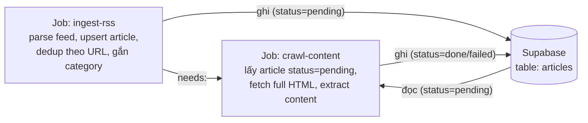

# RSS Ingestion Pipeline — Spec (sub-project 1)

**Ngày:** 2026-08-20
**Trạng thái:** Approved (dùng lại quyết định cũ, cập nhật theo kiến trúc tổng thể mới)
**Thuộc:** [2026-08-20-social-listening-architecture-design.md](./2026-08-20-social-listening-architecture-design.md) — đây là chi tiết hoá phần RSS trong lớp discovery.

## 1. Phạm vi

Ingest RSS từ các báo đã chọn → crawl full nội dung bài viết → gắn danh mục (category) → dedup → lưu vào Supabase.

**Ngoài phạm vi** (thuộc sub-project khác): Apify/deep-crawl mạng xã hội, các nguồn discovery khác (Google Trends, YouTube, TikTok Creative Center, Reddit), công thức trend/share-of-voice, dashboard. Bảng `articles` ở đây là input thô — việc gộp thành `candidate_topics` (tổng hợp cross-source, xem spec kiến trúc tổng thể) là bước tích hợp sau, chưa scope chi tiết trong tài liệu này.

## 2. Kiến trúc job — 2 job GitHub Actions tách riêng

Lý do tách riêng thay vì gộp 1 job: cô lập lỗi — nếu crawl full-content bị lỗi/timeout ở một bài, không ảnh hưởng tới việc ingest RSS mới.

- **Tần suất:** 2–3 lần/ngày (đổi từ hourly trước đây, để khớp cadence chung của toàn kiến trúc — xem spec tổng thể).
- Cả 2 job nằm trong cùng 1 GitHub Actions workflow, `crawl-content` có `needs: ingest-rss`.

## 3. Data model — bảng `articles` (Supabase/Postgres)

> Sơ đồ + chi tiết cột/index/RLS đầy đủ, khớp đúng migration đã apply thực tế: [2026-08-20-rss-ingestion-database-schema.md](./2026-08-20-rss-ingestion-database-schema.md).

| Cột | Ý nghĩa |
|---|---|
| `id` | PK |
| `url` | dedup key (unique) |
| `title`, `published_at`, `source_id` | metadata từ RSS |
| `categories` | mảng, multi-category cho phép |
| `snippet` | mô tả/tóm tắt lấy từ RSS |
| `full_content` | nội dung đầy đủ, điền bởi job `crawl-content` |
| `content_fetch_status` | `pending` / `done` / `failed` — cơ chế handoff giữa 2 job, không dùng queue service riêng |
| `fetch_attempts` | đếm số lần retry, để cắt sau N lần fail |
| `created_at`, `updated_at` | timestamps |

## 4. Category — source of truth nằm trong repo, không phải DB

- `config/sources.config.ts`: danh sách feed RSS, mỗi feed có category mặc định.
- `config/categories.config.ts`: danh sách từ khoá tiếng Việt theo từng danh mục (tài chính / giải trí / du lịch), dùng làm fallback khi feed không có category mặc định khớp.
- Category cuối cùng của 1 bài = category mặc định của feed ∪ các category khớp qua từ khoá trong nội dung. Không có category "overall" riêng — overall là toàn bảng, không lọc.
- Không có admin UI — đổi nguồn/từ khoá đi qua PR review vào file config.

> **Cần làm lại:** bộ seed data cũ (12 feed VnExpress/Tuổi Trẻ/Dân Trí/Thanh Niên, 4/danh mục + từ khoá khởi điểm) đã mất cùng repo cũ — sẽ tái tạo lại ở bước implementation, không chặn việc viết plan.

## 5. Full-content crawl

Crawl toàn bộ nội dung trang gốc (không chỉ dùng RSS snippet) — đánh đổi lấy độ chính xác categorization cao hơn, chấp nhận thêm độ phức tạp (fetch HTML, extract, retry/timeout).

- Lỗi fetch/extract → `content_fetch_status = failed`, tăng `fetch_attempts`, không chặn các bài khác trong cùng lần chạy.
- Vượt quá N lần thử (đề xuất N=3) → giữ nguyên `failed`, không retry vô hạn.

## 6. Stack

Node.js / TypeScript:
- `rss-parser` — đọc RSS feed
- `@extractus/article-extractor` — trích nội dung chính từ trang gốc
- `@supabase/supabase-js` — đọc/ghi Supabase

## 7. Việc còn thiếu (pending, không chặn viết plan)

- **Supabase project:** chưa tạo trong môi trường hiện tại — user sẽ tự tạo khi cần, chưa yêu cầu hướng dẫn.
- **Seed data:** `config/sources.config.ts` và `config/categories.config.ts` cần viết lại (xem mục 4).
- Lịch chạy cụ thể trong ngày (giờ nào trong 2–3 lần/ngày) — chưa chốt giờ chính xác, sẽ quyết khi viết GitHub Actions cron expression.

## 8. Bước tiếp theo

Chuyển sang `writing-plans` để lên implementation plan chi tiết cho sub-project này.
