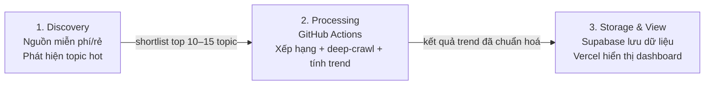
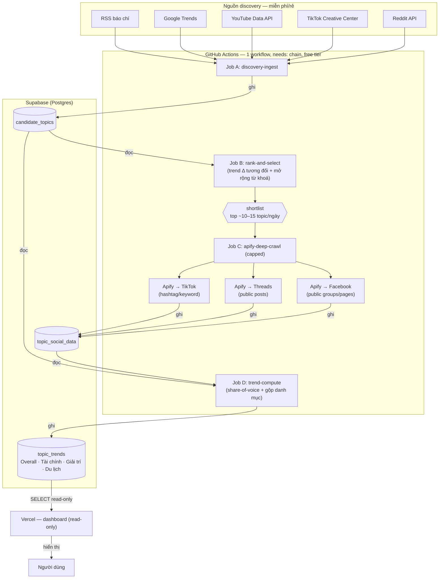

# Social Listening — Kiến trúc tổng thể

**Ngày:** 2026-08-20
**Trạng thái:** Approved (chờ user review lần cuối trước khi chuyển sang writing-plans)
**Phạm vi:** Kiến trúc ingestion tổng thể (nguồn → xử lý → lưu trữ → hiển thị). Không bao gồm công thức chỉ số phân tích (xem mục "Ngoài phạm vi").

## 1. Vấn đề cần giải quyết

Xây tool social listening lấy hot topic đang được thảo luận trên báo + mạng xã hội hàng ngày, có 1 view "Overall" + 3 view theo danh mục (Tài chính, Giải trí, Du lịch). Ba giới hạn gốc:

1. **Chỉ lấy báo (RSS) → bỏ sót tin nổi trên mạng xã hội trước khi lên báo.**
2. **Lấy mạng xã hội qua Apify trên diện rộng → chi phí quá lớn**, không bền vững với ngân sách hẹp.
3. **Deploy trên Vercel** → cron Hobby chỉ chạy 1 lần/ngày, function timeout ~60s → không phù hợp để chạy crawl/ingest trực tiếp trong Vercel.

## 2. Quyết định kiến trúc: Hot Topic Funnel (phễu 2 lớp)

**Lớp discovery (miễn phí/rẻ)** phát hiện "cái gì đang nổi" bằng các nguồn không tốn phí crawl xã hội diện rộng:
- RSS (báo chí)
- Google Trends
- YouTube Data API (trending/search)
- TikTok Creative Center (trending hashtag/keyword)
- Reddit API

**Lớp deep-crawl (Apify, có trần cứng)** chỉ chạy targeted search (theo keyword/hashtag) trên các nền tảng mà discovery layer không thể quan sát trực tiếp — **Facebook, Threads, TikTok** — và chỉ nhắm vào đúng shortlist top ~10–15 topic/ngày mà lớp discovery đã xác nhận là hot. Không bao giờ crawl tràn lan.

Vì Apify chỉ được gọi đúng N lần/ngày theo shortlist đã lọc (không phụ thuộc lượng tin thực tế phát sinh), **chi phí có trần dự đoán được: < $30/tháng**, chia sẻ chung giữa Facebook/Threads/TikTok chứ không cộng dồn theo từng nền tảng.

### Nguyên lý tính trend

Không nguồn thu thập nào là mẫu unbiased (crawl bias không thể triệt tiêu hoàn toàn) — nên hệ thống track **thay đổi tương đối theo thời gian** (vd "+30% so với hôm qua") thay vì so sánh số tuyệt đối giữa các nguồn khác nhau. Từ khóa được mở rộng qua co-occurrence mining thay vì dùng danh sách từ khóa cố định.

### Giới hạn đã biết (blind spot)

Facebook và Threads (cùng thuộc Meta) không có API trending công khai nào — lớp discovery không có tín hiệu miễn phí cho hai nền tảng này. Một topic thuần Facebook/Threads chỉ được phát hiện nếu:
- nó lan sang một nguồn discovery khác trước (báo đưa tin, lên YouTube/TikTok...), hoặc
- nó nằm trong danh sách Page/Group/tài khoản đã seed sẵn cho Apify.

Đây là đánh đổi có chủ đích để giữ chi phí trong ngân sách, không phải lỗi thiết kế.

## 3. Hạ tầng: tách 3 lớp để lách giới hạn Vercel

| Lớp | Vai trò |
|---|---|
| **GitHub Actions** | Scheduler + compute. Chạy 1 workflow gồm 4 job tuần tự (`needs:` chain): `discovery-ingest` → `rank-and-select` → `apify-deep-crawl` → `trend-compute`. Tần suất: **2–3 lần/ngày**. Free tier. |
| **Supabase (Postgres)** | Lưu trữ + nơi trung chuyển dữ liệu giữa các job. Bảng chính: `candidate_topics` (output discovery), `topic_social_data` (output deep-crawl), `topic_trends` (output cuối, gắn danh mục Overall/Tài chính/Giải trí/Du lịch). |
| **Vercel** | Chỉ host dashboard, **read-only**, SELECT từ Supabase. Không cron, không crawl, không compute — nên không đụng giới hạn 1 lần/ngày hay timeout 60s của Vercel Hobby. |

### Sơ đồ 3 lớp

Tóm tắt cách đọc: **Discovery tìm đúng chủ đề**, **GitHub Actions xử lý theo lịch**, còn **Supabase và Vercel lưu trữ rồi hiển thị kết quả**. Apify chỉ xuất hiện bên trong lớp Processing khi topic đã qua shortlist.

## 4. Luồng dữ liệu

> Bản visual tham khảo (Artifact, không thay thế tài liệu này): "Hot Topic Funnel" — dựng trong phiên brainstorm 2026-08-20.

## 5. Danh mục

Một topic có thể thuộc nhiều danh mục cùng lúc (multi-category). Không có danh mục "overall" riêng — Overall là toàn bộ bảng, không lọc. 3 danh mục: Tài chính, Giải trí, Du lịch.

## 6. Thông số đã chốt

| Thông số | Giá trị |
|---|---|
| Trần chi phí Apify | < $30/tháng (chia sẻ giữa FB/Threads/TikTok) |
| Tần suất chạy pipeline | 2–3 lần/ngày |
| Số topic deep-crawl/ngày | ~10–15 (shortlist sau discovery) |
| Nền tảng discovery (miễn phí) | RSS, Google Trends, YouTube Data API, TikTok Creative Center, Reddit API |
| Nền tảng deep-crawl (Apify, trả phí) | Facebook, Threads, TikTok |
| Hạ tầng | GitHub Actions (compute) + Supabase (lưu trữ) + Vercel (dashboard read-only) |

## 7. Ngoài phạm vi (deferred có chủ đích)

- **X (Twitter)** — quyết định loại khỏi phạm vi cover, không nằm ở lớp discovery lẫn lớp Apify. Lý do: ít quan trọng với người dùng VN hơn Facebook/TikTok, trong khi API X hiện rất đắt và giới hạn ngặt — chi phí/effort không tương xứng với lợi ích. Quyết định này chốt ngày 2026-08-20, có thể xem lại nếu nhu cầu thay đổi.
- **Công thức chỉ số cụ thể** (share-of-voice, sentiment, engagement, buzz volume...) tham khảo từ Buzzmetrics — để dành cho sub-project riêng "Trend / Share-of-voice computation" (sub-project 3), chưa brainstorm chi tiết. Job `trend-compute` trong sơ đồ trên hiện chỉ là placeholder tên job.
- Chi tiết pipeline RSS ingestion (parser, extractor, schema đầy đủ, category keyword list) — thuộc sub-project 1, xem thiết kế riêng khi viết lại (thư mục cũ đã mất do repo bị reset, cần viết lại spec cho sub-project này).
- Chi tiết Apify actor cụ thể, cấu hình targeted search, danh sách Page/Group/tài khoản seed cho Facebook/Threads — thuộc sub-project 2.
- Thiết kế UI dashboard — thuộc sub-project 4.

## 8. Thứ tự triển khai (sub-project)

1. RSS ingestion pipeline (viết lại từ đầu — repo trước đó không còn)
2. Apify / social media crawl ingestion (discovery layer còn lại + deep-crawl Facebook/Threads/TikTok)
3. Trend / share-of-voice computation
4. Dashboard (Overall + 3 danh mục)

Mỗi sub-project có chu trình spec → plan → implementation riêng.

## 9. Ghi chú tuân thủ

Crawl mạng xã hội (đặc biệt Facebook/Threads) qua Apify nằm trong vùng xám ToS/pháp lý. Chấp nhận được cho tool nội bộ tham khảo xu hướng; cần review compliance nếu tool hoặc dữ liệu này được đưa vào sản phẩm thương mại/đối ngoại — đáng lưu ý vì đây là dự án cá nhân của người làm trong ngành fintech.
