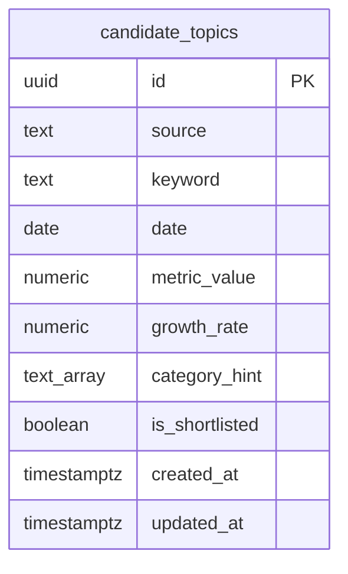

# Discovery Layer — Database Schema

**Ngày:** 2026-08-21
**Trạng thái:** Chưa deploy — migration 0003 chưa apply lên production
**Thuộc:** chi tiết hoá phần data model của [2026-08-21-discovery-layer-design.md](./2026-08-21-discovery-layer-design.md) §3, phản ánh đúng migration đã viết (`supabase/migrations/0003_create_candidate_topics_table.sql`), chưa phải bản đã chạy thật trên Supabase.

## Sơ đồ

Thêm 1 bảng mới — `candidate_topics` — bên cạnh `articles` đã có từ sub-project 1 (xem [2026-08-20-rss-ingestion-database-schema.md](./2026-08-20-rss-ingestion-database-schema.md)). `articles` không đổi schema ở sub-project này; `RssTopicSource` chỉ đọc từ nó, không ghi thêm cột.

## Chi tiết cột

| Cột | Kiểu | Ràng buộc | Ghi chú |
|---|---|---|---|
| `id` | `uuid` | PK, `default gen_random_uuid()` | tự sinh, không truyền lúc insert |
| `source` | `text` | `not null`, `check (source in ('google_trends', 'youtube', 'rss'))` | đúng 3 nguồn discovery trong phạm vi sub-project 2a |
| `keyword` | `text` | `not null` | đã chuẩn hoá lowercase + trim ở tầng app (từng adapter tự làm việc này trước khi upsert) |
| `date` | `date` | `not null` | ngày ghi nhận tín hiệu, không phải timestamp — dùng để nhóm candidate theo ngày cho `getTodayCandidates`/`rankAndSelect` |
| `metric_value` | `numeric` | `not null default 0` | số liệu thô, **đơn vị khác nhau theo nguồn**: traffic (Google Trends), view count (YouTube), tần suất xuất hiện trong tiêu đề bài báo cửa sổ rolling gần nhất (RSS) — xem mục Known gaps #2 |
| `growth_rate` | `numeric` | nullable | % thay đổi so với baseline; Google Trends trả sẵn từ thư viện, YouTube/RSS tự tính trong `rank-and-select.ts` — xem mục Known gaps #1 |
| `category_hint` | `text[]` | `not null default '{}'` | category suy ra từ `categorize()` có sẵn (tái dùng từ sub-project 1); có thể rỗng nếu từ khoá không match category nào |
| `is_shortlisted` | `boolean` | `not null default false` | job `rank-and-select` set `true` cho candidate lọt shortlist; xem mục Known gaps #4 về việc cờ này không bao giờ bị reset |
| `created_at` | `timestamptz` | `not null default now()` | |
| `updated_at` | `timestamptz` | `not null default now()` | tự cập nhật qua trigger `candidate_topics_set_updated_at` (cùng migration `0003`, dùng lại function `set_updated_at()` đã tạo ở migration `0002`) |

Ràng buộc bổ sung: `unique (source, keyword, date)` — key dedup, `upsertCandidate` dùng `onConflict: 'source,keyword,date'` để ghi đè thay vì tạo bản trùng khi cùng 1 nguồn/từ khoá xuất hiện lại trong cùng ngày.

## Index

- `candidate_topics_date_idx` — btree trên `date`, phục vụ `getTodayCandidates(date)` (job `rank-and-select` đọc toàn bộ candidate của 1 ngày).
- `candidate_topics_shortlisted_idx` — btree trên `is_shortlisted`, phục vụ sub-project 2b (Apify deep-crawl) lọc `is_shortlisted = true`.
- Ràng buộc `unique (source, keyword, date)` đồng thời đóng vai trò index hỗ trợ `getRecentMetrics(source, keyword, sinceDate, beforeDate)` — query này lọc theo đúng 3 cột đầu của unique constraint (cộng thêm range trên `date`), nên tận dụng được index của constraint mà không cần thêm index riêng.

`getTodayCandidates` sắp theo `metric_value` giảm dần và giới hạn 5000 dòng (safety net theo giới hạn "Max rows" mặc định của PostgREST trên Supabase, không phải giá trị đã tune) — nếu bị cắt bớt thì candidate có tín hiệu mạnh nhất vẫn còn, phục vụ đúng nhu cầu chọn top-N của `rankAndSelect`.

## Row Level Security

`alter table candidate_topics enable row level security;` — **bật nhưng chưa có policy nào**, cùng trạng thái với `articles` (xem [RSS ingestion schema doc](./2026-08-20-rss-ingestion-database-schema.md#row-level-security)). An toàn ở giai đoạn hiện tại vì toàn bộ ghi/đọc đều qua `service_role` key (bypass RLS) trong GitHub Actions; chặn hoàn toàn truy cập qua `anon`/`publishable` key cho tới khi có consumer thật (dashboard sub-project 4, hoặc sub-project 2b nếu đọc trực tiếp bằng key public) cần thêm policy.

## Known gaps / limitations

Các điểm sau được ghi nhận từ review cuối sub-project 2a, cố ý để lại (deferred), không phải bug chưa fix:

1. **`growth_rate` không đồng nhất đơn vị giữa các nguồn**: Google Trends trả % tăng trưởng gốc từ thư viện, còn YouTube/RSS được tính là tỷ lệ (ratio) trong `rank-and-select.ts` — không ảnh hưởng xếp hạng (mỗi nguồn so sánh độc lập) nhưng không nên đọc `growth_rate` như một con số tuyệt đối giữa các nguồn cho tới khi được chuẩn hoá.
2. **RSS `metric_value` dùng cửa sổ rolling 5 ngày** (không phải tần suất trong ngày như spec §4 mô tả) — làm giảm độ nhạy tín hiệu tăng trưởng cho nguồn RSS cụ thể; đây là lựa chọn có chủ đích của plan, không phải lỗi implementation, nhưng cần cân nhắc lại nếu RSS-sourced candidates có vẻ xếp hạng thấp bất thường.
3. **Khối lượng ghi/đọc chưa có giới hạn ở tầng aggregation** (`extractKeywords` sinh cả unigram + bigram trên toàn bộ tiêu đề 5 ngày, không cap) kết hợp với I/O tuần tự từng dòng (không batch) — có nguy cơ job chạy lâu/tốn kém ở khối lượng dữ liệu thực; nên xử lý trước lần chạy theo lịch đầu tiên của workflow.
4. **`is_shortlisted` chỉ được set `true`, không bao giờ reset lại `false` cho ngày cũ** — sub-project 2b (Apify deep-crawl) cần tự lọc theo `date`, không chỉ theo `is_shortlisted`.
