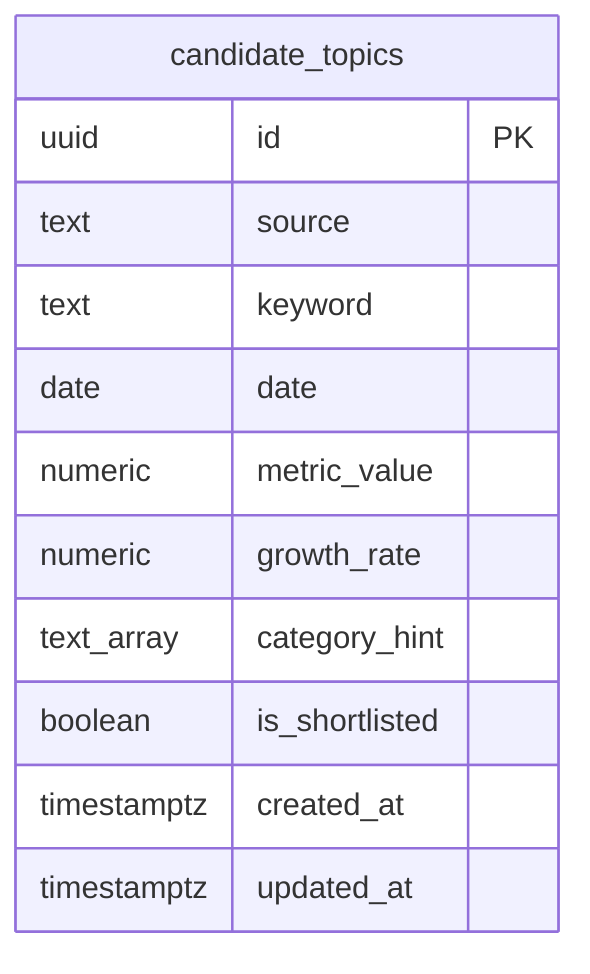

# Discovery Layer — Database Schema

**Ngày:** 2026-08-21
**Trạng thái:** Chưa deploy — migration 0003 chưa apply lên production
**Thuộc:** chi tiết hoá phần data model của [2026-08-21-discovery-layer-design.md](./2026-08-21-discovery-layer-design.md) §3, phản ánh đúng migration đã viết (`supabase/migrations/0003_create_candidate_topics_table.sql`), chưa phải bản đã chạy thật trên Supabase.

## Sơ đồ

Thêm 1 bảng mới — `candidate_topics` — bên cạnh `articles` đã có từ sub-project 1 (xem [2026-08-20-rss-ingestion-database-schema.md](./2026-08-20-rss-ingestion-database-schema.md)). `articles` không đổi schema ở sub-project này; `RssTopicSource` chỉ đọc từ nó, không ghi thêm cột.

## Chi tiết cột

| Cột | Kiểu | Ràng buộc | Ghi chú |
|---|---|---|---|
| `id` | `uuid` | PK, `default gen_random_uuid()` | tự sinh, không truyền lúc insert |
| `source` | `text` | `not null`, `check (source in ('google_trends', 'youtube', 'rss'))` | đúng 3 nguồn discovery trong phạm vi sub-project 2a |
| `keyword` | `text` | `not null` | đã chuẩn hoá lowercase + trim ở tầng app (từng adapter tự làm việc này trước khi upsert) |
| `date` | `date` | `not null` | ngày ghi nhận tín hiệu, không phải timestamp — dùng để nhóm candidate theo ngày cho `getTodayCandidates`/`rankAndSelect` |
| `metric_value` | `numeric` | `not null default 0` | số liệu thô, **đơn vị khác nhau theo nguồn**: traffic (Google Trends), view count (YouTube), tần suất xuất hiện trong tiêu đề bài báo **của đúng ngày hôm đó** (RSS, `LOOKBACK_DAYS = 1` từ 2026-08-21) |
| `growth_rate` | `numeric` | nullable | tỷ lệ thay đổi so với baseline 7 ngày, **cùng đơn vị cho cả 3 nguồn** kể từ 2026-08-21 — Google Trends chuẩn hoá về tỷ lệ qua `normalizeGrowthRate()` (chia %/100) trước khi lưu; YouTube/RSS tự tính tỷ lệ trong `rank-and-select.ts` |
| `category_hint` | `text[]` | `not null default '{}'` | category suy ra từ `categorize()` có sẵn (tái dùng từ sub-project 1); có thể rỗng nếu từ khoá không match category nào |
| `is_shortlisted` | `boolean` | `not null default false` | job `rank-and-select` set `true` cho candidate lọt top-10/nguồn (mặc định `DEFAULT_TOP_PER_SOURCE = 10` từ 2026-08-21); xem mục Known gaps về việc cờ này không bao giờ bị reset |
| `created_at` | `timestamptz` | `not null default now()` | |
| `updated_at` | `timestamptz` | `not null default now()` | tự cập nhật qua trigger `candidate_topics_set_updated_at` (cùng migration `0003`, dùng lại function `set_updated_at()` đã tạo ở migration `0002`) |

Ràng buộc bổ sung: `unique (source, keyword, date)` — key dedup, `upsertCandidate` dùng `onConflict: 'source,keyword,date'` để ghi đè thay vì tạo bản trùng khi cùng 1 nguồn/từ khoá xuất hiện lại trong cùng ngày.

## Index

- `candidate_topics_date_idx` — btree trên `date`, phục vụ `getTodayCandidates(date)` (job `rank-and-select` đọc toàn bộ candidate của 1 ngày).
- `candidate_topics_shortlisted_idx` — btree trên `is_shortlisted`, phục vụ sub-project 2b (Apify deep-crawl) lọc `is_shortlisted = true`.
- Ràng buộc `unique (source, keyword, date)` đồng thời đóng vai trò index hỗ trợ `getRecentMetrics(source, keyword, sinceDate, beforeDate)` — query này lọc theo đúng 3 cột đầu của unique constraint (cộng thêm range trên `date`), nên tận dụng được index của constraint mà không cần thêm index riêng.

`getTodayCandidates` sắp theo `metric_value` giảm dần và giới hạn 5000 dòng (safety net theo giới hạn "Max rows" mặc định của PostgREST trên Supabase, không phải giá trị đã tune). Kể từ 2026-08-21, mỗi nguồn tự giới hạn tối đa 200 candidate trước khi ghi (`aggregate-rss-keywords.ts`/`aggregate-youtube-keywords.ts`), nên tổng số dòng/ngày thường dưới ~600 — giới hạn 5000 gần như không bao giờ bị chạm tới nữa trong vận hành bình thường, chỉ còn là lớp an toàn cuối cùng.

## Row Level Security

`alter table candidate_topics enable row level security;` — **bật nhưng chưa có policy nào**, cùng trạng thái với `articles` (xem [RSS ingestion schema doc](./2026-08-20-rss-ingestion-database-schema.md#row-level-security)). An toàn ở giai đoạn hiện tại vì toàn bộ ghi/đọc đều qua `service_role` key (bypass RLS) trong GitHub Actions; chặn hoàn toàn truy cập qua `anon`/`publishable` key cho tới khi có consumer thật (dashboard sub-project 4, hoặc sub-project 2b nếu đọc trực tiếp bằng key public) cần thêm policy.

## Known gaps / limitations

**Đã fix (2026-08-21, cùng ngày merge, theo yêu cầu người dùng xử lý các finding còn tồn đọng từ review cuối):**

- **Đơn vị `growth_rate` đã đồng nhất giữa 3 nguồn** — `GoogleTrendsSource` giờ chia `trafficGrowthRate` cho 100 (`normalizeGrowthRate()`) trước khi lưu, cùng đơn vị tỷ lệ với YouTube/RSS.
- **RSS `metric_value` đổi từ cửa sổ rolling 5 ngày sang tính đúng tần suất trong ngày** (`RssTopicSource.LOOKBACK_DAYS` 5 → 1), khớp đúng spec §4. Baseline 7 ngày để tính `growth_rate` không đổi — vẫn tự đọc lịch sử `metric_value` từng ngày từ `candidate_topics`.
- **Giới hạn khối lượng từ khoá + gom ghi thành lô**: `aggregateRssKeywords`/`aggregateYouTubeKeywords` giờ chỉ giữ top 200 candidate/nguồn theo `metric_value` (`capCandidates()`, vì chỉ top-10/nguồn mới vào shortlist, giữ 200 là dư sức). `discovery-ingest.ts` ghi theo lô (`CandidateTopicRepository.upsertCandidates()`, tối đa 200 dòng/lần gọi) thay vì từng dòng một — giảm số round-trip DB từ hàng nghìn xuống còn 1 lần/nguồn trong vận hành bình thường.
- **Shortlist mở rộng từ top-5 lên top-10/nguồn** (`DEFAULT_TOP_PER_SOURCE` trong `rank-and-select.ts`) — quyết định của người dùng.
- **Sửa lỗi mất `growth_rate`/`is_shortlisted` khi cùng 1 từ khoá bị ingest lại trong ngày**: workflow chạy `discovery-ingest` → `rank-and-select` 3 lần/ngày, cùng ghi vào 1 `date`. Trước fix, mỗi lần `discovery-ingest` chạy lại đều ghi đè `growth_rate`/`is_shortlisted` về null/false vô điều kiện cho MỌI từ khoá — kể cả từ khoá đã được `rank-and-select` tính/gắn shortlist ở lần chạy trước đó cùng ngày. `discovery-ingest.ts` giờ chỉ đưa `growth_rate` vào payload khi nguồn tự cung cấp giá trị thật (Google Trends — luôn mới mỗi lần fetch, an toàn để ghi đè); YouTube/RSS (`growth_rate` luôn null lúc fetch) và `is_shortlisted` (chỉ `rank-and-select` được set) hoàn toàn không xuất hiện trong payload upsert — dựa vào cơ chế merge theo cột của Supabase/PostgREST khi conflict (cột vắng mặt trong payload thì không bị đụng tới), cùng cơ chế mà `upsertCandidate`/`upsertCandidates` đã dùng từ đầu (không set `ignoreDuplicates: true`).

**Cố ý chưa xử lý:**

- **`is_shortlisted` chỉ được set `true`, không bao giờ reset lại `false` cho ngày cũ** — sub-project 2b (Apify deep-crawl) cần tự lọc theo `date`, không chỉ theo `is_shortlisted`.
- `rank-and-select.ts` vẫn đọc/ghi `growth_rate` từng dòng một (`getRecentMetrics`/`updateGrowthRate`), chưa gom lô — quyết định có chủ đích: sau khi giới hạn 200 candidate/nguồn, khối lượng tối đa còn lại (~400-600 dòng/ngày) đủ nhỏ để chấp nhận được mà không cần thêm 1 SQL function tùy chỉnh (Supabase client không hỗ trợ batch UPDATE theo giá trị khác nhau cho từng dòng).
