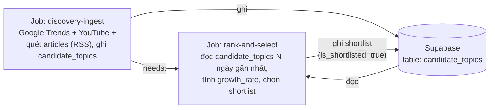

# Discovery Layer — Spec (sub-project 2a)

**Ngày:** 2026-08-21
**Trạng thái:** Approved, chờ viết plan
**Thuộc:** chi tiết hoá lớp discovery trong [2026-08-20-social-listening-architecture-design.md](./2026-08-20-social-listening-architecture-design.md) §2/§4. Sub-project 2a trong thứ tự triển khai §8 — phần còn lại của "Apify / social media crawl ingestion", tách riêng khỏi lớp deep-crawl Apify (sub-project 2b, chưa brainstorm).

## 1. Phạm vi

Phát hiện topic đang "nổi" mỗi ngày từ các nguồn miễn phí, xếp hạng theo mức thay đổi tương đối, chọn ra shortlist đưa sang lớp Apify deep-crawl (sub-project 2b) đào sâu Facebook/Threads/TikTok.

**Trong phạm vi:**
- 3 nguồn discovery: **Google Trends**, **YouTube Data API**, và **RSS** (bảng `articles` có sẵn từ sub-project 1 — tham gia phát hiện topic, không chỉ đứng riêng).
- Bảng `candidate_topics` lưu tín hiệu thô theo (nguồn, từ khoá, ngày).
- Thuật toán rank-and-select: mỗi nguồn tự xếp hạng nội bộ theo % thay đổi, gộp top mỗi nguồn thành shortlist.
- Gắn category (tài chính/giải trí/du lịch) cho từng candidate topic, tái dùng `categorize()` có sẵn.

**Ngoài phạm vi (sub-project khác):**
- Apify deep-crawl Facebook/Threads/TikTok, ngân sách thực tế, cấu hình actor, seed list Page/Group — **sub-project 2b**.
- Công thức trend/share-of-voice cuối cùng — **sub-project 3**.
- Dashboard — **sub-project 4**.
- Reddit API — loại khỏi phạm vi (cần xin duyệt thủ công 2-4 tuần, không tự động hoá được — xem §7).
- TikTok Creative Center làm nguồn discovery — loại khỏi phạm vi, xem lý do kỹ thuật ở §7 (TikTok vẫn được phủ gián tiếp qua lớp deep-crawl ở sub-project 2b).

## 2. Kiến trúc job

Mirror đúng pattern 2-job của sub-project 1 (RSS ingestion): 1 workflow GitHub Actions riêng, 2 job nối tiếp qua `needs:`.

- Workflow riêng: `.github/workflows/discovery-ingestion.yml`, không gộp vào `rss-ingestion.yml` (khác nguồn lỗi, khác API bên ngoài, cô lập lỗi giống lý do tách 2 job RSS ban đầu).
- Tần suất: 2-3 lần/ngày, giống RSS. Giờ cụ thể chốt lúc viết plan.
- `apify-deep-crawl` (Job C trong sơ đồ tổng thể) **không** nằm trong workflow này — đó là sub-project 2b, workflow riêng, đọc `candidate_topics` nơi `is_shortlisted = true`.

## 3. Data model — bảng `candidate_topics` (mới)

| Cột | Kiểu | Ghi chú |
|---|---|---|
| `id` | `uuid` | PK |
| `source` | `text` | `google_trends` \| `youtube` \| `rss` |
| `keyword` | `text` | từ khoá/topic, đã chuẩn hoá (lowercase, trim) |
| `date` | `date` | ngày ghi nhận |
| `metric_value` | `numeric` | số liệu thô: traffic (Google Trends), view count (YouTube), tần suất xuất hiện trong tiêu đề bài báo N ngày gần nhất (RSS) |
| `growth_rate` | `numeric`, nullable | % thay đổi so với baseline. Google Trends trả sẵn (`trafficGrowthRate`); YouTube/RSS được Job B tự tính từ lịch sử `metric_value` |
| `category_hint` | `text[]`, nullable | category suy ra từ `categorize()`, có thể rỗng nếu từ khoá không match keyword nào |
| `is_shortlisted` | `boolean`, default `false` | Job B đánh dấu `true` cho các dòng lọt shortlist |
| `created_at` | `timestamptz` | |

Index: btree trên `(source, keyword, date)` (unique — 1 dòng/nguồn/từ khoá/ngày, dùng làm `onConflict` khi upsert), btree trên `date` (Job B quét N ngày gần nhất), index trên `is_shortlisted` (sub-project 2b đọc).

## 4. Ba nguồn discovery

### Google Trends
- Lib: `@alkalisummer/google-trends-js` — **đã spike, xác nhận hoạt động thật cho VN** (`dailyTrends({geo:'VN', hl:'vi'})` trả ~80 topic, `realTimeTrends` trả ~15 topic, kèm sẵn `trafficGrowthRate`).
- `GoogleTrendsSource implements DiscoverySource` — không cần credential.
- Ghi thẳng `keyword`, `metric_value = traffic`, `growth_rate = trafficGrowthRate`.

### YouTube Data API
- `videos.list(chart='mostPopular', regionCode='VN')` — cần `YOUTUBE_API_KEY` (đã tạo, xem hướng dẫn trong hội thoại brainstorm).
- Từ khoá lấy từ `snippet.tags` + trích xuất từ `snippet.title` qua `extractKeywords()` (xem §5).
- `metric_value = viewCount`. `growth_rate` không có sẵn — Job B tự tính.

### RSS (bảng `articles`)
- Đọc các dòng `articles` trong N ngày gần nhất (N chốt lúc viết plan, đề xuất 3-7 ngày).
- Trích từ khoá từ `title` qua `extractKeywords()`.
- `metric_value` = tần suất xuất hiện của từ khoá trong tiêu đề các bài của ngày đó.
- `growth_rate` không có sẵn — Job B tự tính.

## 5. Trích từ khoá — `extractKeywords(text): string[]`

Hàm thuần, test được (TDD), không dùng NLP/AI ngoài — giữ đúng tinh thần đơn giản của `categorize()`:
1. Tách từ theo khoảng trắng/dấu câu.
2. Bỏ stop-word tiếng Việt (danh sách nhỏ viết tay, tương tự cách `categories.config.ts` liệt kê từ khoá).
3. Giữ lại cụm 2 từ liền kề có độ dài > 2 ký tự mỗi từ. (Đổi từ "cụm 1-2 từ" ban đầu — bỏ hẳn từ đơn 2026-08-23 vì từ đơn chung chung/từ lóng lấn át cụm có nghĩa trong shortlist theo tần suất thô; xem "Known gaps" trong schema doc.)
4. Trả về danh sách từ khoá (có thể trùng lặp — bên gọi tự đếm tần suất).

## 6. Thuật toán rank-and-select (Job B)

**Nguyên tắc:** không so sánh số tuyệt đối giữa các nguồn khác nhau (đã chốt ở spec kiến trúc tổng thể §2 "Nguyên lý tính trend").

1. Với mỗi nguồn, tính `growth_rate` cho từng từ khoá:
   - Google Trends: dùng field có sẵn.
   - YouTube/RSS: `(metric_value hôm nay − trung bình metric_value 7 ngày trước) / trung bình 7 ngày trước`. Nếu từ khoá **chưa từng xuất hiện** trong 7 ngày trước (trung bình = 0, tránh chia 0): coi là từ khoá mới, gán `growth_rate` bằng 1 giá trị sentinel cao cố định (vd `999`) để nó tự nhiên được xếp hạng cao — một từ khoá hoàn toàn mới xuất hiện đột ngột chính là tín hiệu "nổi" mạnh nhất, không cần baseline để so sánh.
2. Trong mỗi nguồn, xếp hạng theo `growth_rate` giảm dần, lấy **top 5**.
3. Gộp danh sách từ 3 nguồn (tối đa 15 dòng), khử trùng lặp theo `keyword` đã chuẩn hoá (exact match, không fuzzy — YAGNI).
4. Đánh dấu `is_shortlisted = true` cho các dòng trong shortlist.

> Số "top 5/nguồn" là tham số cấu hình (không hard-code cứng trong logic), vì con số phù hợp phụ thuộc ngân sách Apify thực tế — **sẽ đo lại bằng giá thật khi bắt đầu sub-project 2b**, không chốt cứng ở đây (xem §7).

## 7. Quyết định & rủi ro đã ghi nhận (từ phiên brainstorm 2026-08-21)

- **Reddit API loại khỏi phạm vi**: free tier chỉ cho non-commercial (hợp), nhưng self-service OAuth registration đã đóng — phải nộp đơn xin duyệt thủ công 2-4 tuần. Không tự động hoá được trong scope sub-project này.
- **TikTok Creative Center loại khỏi discovery layer**: đã spike thực tế — gọi thẳng endpoint `ads.tiktok.com/creative_radar_api/v1/popular_trend/hashtag/list` trả về `{"code":40101,"msg":"no permission"}`; kiểm tra thêm cho thấy trang public không set cookie phiên qua HTTP header (phải chạy JS thật trong browser để sinh phiên) → chỉ khả thi qua Apify actor trả phí hoặc browser automation tự viết (Puppeteer, dễ gãy vì TikTok chống bot mạnh, đặc biệt chạy trên IP dùng chung của GitHub Actions). Không tương xứng chi phí/công sức bảo trì so với lợi ích 1 nguồn discovery bổ sung. TikTok vẫn được phủ ở lớp deep-crawl (sub-project 2b) khi đã lọt shortlist từ nguồn khác.
- **Ngân sách Apify <$30/tháng có thể không khớp giá thực tế 2026**: tra giá thô (Facebook Groups ~$0.0026/post + cần residential proxy từ gói Starter $29/tháng; TikTok ~$0.03/run + $0.004/kết quả; Threads $1-20/1000 post) → ước tính 10-15 topic/ngày × 3 platform có thể ra **$90-180/tháng**, vượt xa trần đã chốt. Đây là vấn đề của **sub-project 2b**, không chặn sub-project 2a (lớp discovery hoàn toàn miễn phí). Cần đo giá thật bằng 1 lần chạy thử Apify trước khi chốt số lượng topic/ngày cuối cùng.
- **Google Trends đã verify hoạt động thật** cho geo VN qua spike trực tiếp (xem §4).

## 8. Category

Tái dùng `categorize()` + `config/categories.config.ts` có sẵn từ sub-project 1 — không tạo cơ chế category mới. Match trực tiếp trên `keyword` (cụm ngắn), chấp nhận độ chính xác thấp hơn so với match trên toàn văn bài báo — nếu sau này thấy category_hint sai nhiều, có thể cải thiện sau (không chặn implementation lần này).

## 9. Hạ tầng & secrets

- Cùng repo/package với sub-project 1 — không tách project mới.
- File mới dự kiến: `src/lib/google-trends-fetcher.ts`, `src/lib/youtube-fetcher.ts`, `src/lib/keyword-extractor.ts`, `src/lib/candidate-topic-repository.ts`, `src/discovery-ingest.ts`, `src/rank-and-select.ts`, `src/run-discovery-ingest.ts`, `src/run-rank-and-select.ts`.
- Migration mới: `supabase/migrations/0003_create_candidate_topics_table.sql`.
- Secret GitHub mới: `YOUTUBE_API_KEY` (Google Trends không cần key; Supabase secrets tái dùng từ sub-project 1).
