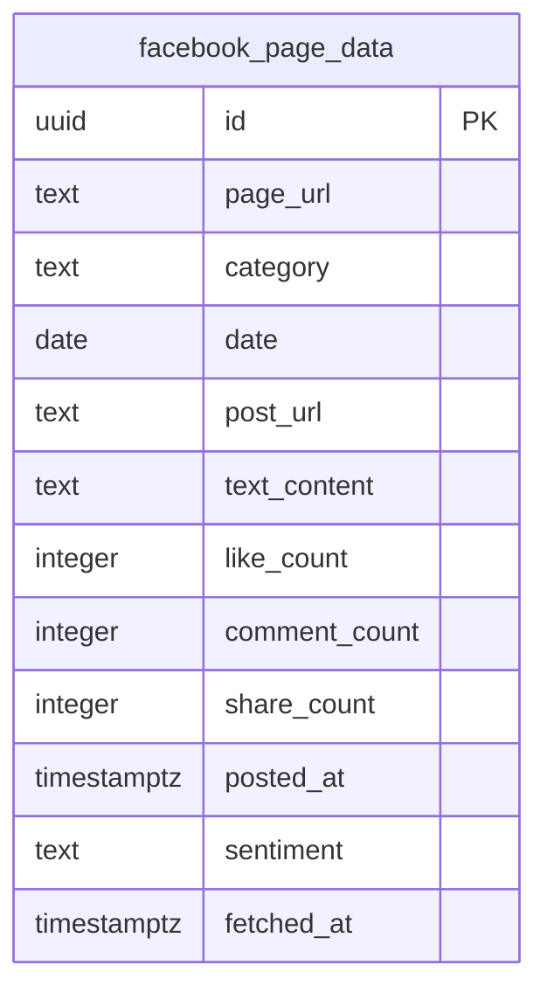

# Deep-crawl Facebook — Database Schema

**Ngày:** 2026-08-23
**Trạng thái:** Chưa deploy — migration 0005 chưa apply lên production
**Thuộc:** chi tiết hoá phần data model của [2026-08-23-deep-crawl-facebook-design.md](./2026-08-23-deep-crawl-facebook-design.md), phản ánh đúng migration đã viết (`supabase/migrations/0005_add_facebook_page_data.sql`), chưa phải bản đã chạy thật trên Supabase.

## Sơ đồ

Thêm 1 bảng mới — `facebook_page_data` — bên cạnh `topic_social_data` (sub-project 2b, xem [2026-08-23-deep-crawl-threads-database-schema.md](./2026-08-23-deep-crawl-threads-database-schema.md)). Khác `topic_social_data`, bảng này không có cột `keyword` — gắn theo `category` vì Facebook không hỗ trợ search theo từ khóa (xem design spec §1/§2). Không đọc/ghi `candidate_topics` — seed list tĩnh, không phụ thuộc shortlist hôm đó.

## Chi tiết cột

| Cột | Kiểu | Ràng buộc | Ghi chú |
|---|---|---|---|
| `id` | `uuid` | PK, `default gen_random_uuid()` | tự sinh |
| `page_url` | `text` | `not null` | URL Page nguồn, khớp `facebook-seed-pages.ts` |
| `category` | `text` | `not null`, `check (category in ('tai_chinh','giai_tri','du_lich'))` | gán sẵn per-page lúc curate seed list, KHÔNG suy ra từ nội dung bài viết — 1 Page luôn thuộc đúng 1 category cố định |
| `date` | `date` | `not null` | ngày chạy deep-crawl (UTC calendar date), dùng cho idempotency guard `hasDataForDate(date)` |
| `post_url` | `text` | `not null` | key dedup cùng `page_url` — xem `unique` bên dưới |
| `text_content` | `text` | `not null default ''` | rỗng nếu actor trả sai kiểu, thay vì null vì cột `not null` |
| `like_count` / `comment_count` / `share_count` | `integer` | nullable | engagement thô từ actor; `null` nếu actor không trả về hoặc trả sai kiểu (runtime-checked, không ép kiểu bằng `as`) |
| `posted_at` | `timestamptz` | nullable | thời điểm đăng bài, `null` nếu actor không trả về hoặc trả sai kiểu |
| `sentiment` | `text` | nullable, `check (sentiment in ('positive','negative','neutral'))` | phân loại bởi `classify-sentiment.ts` (sub-project 3), thêm ở migration `0006`. `NULL` = chưa phân loại. Xem [schema doc sub-project 3](./2026-08-23-sentiment-engagement-metrics-database-schema.md) |
| `fetched_at` | `timestamptz` | `not null default now()` | thời điểm job ghi dòng này, không tự cập nhật khi upsert đè lên dòng cũ |

Ràng buộc bổ sung: `unique (page_url, post_url)` — key dedup, `FacebookPageDataRepository.upsertPosts()` dùng `onConflict: 'page_url,post_url'`.

## Index

- `facebook_page_data_date_idx` — btree trên `date`, phục vụ `hasDataForDate(date)` và query đọc theo ngày ở sub-project 3 sau này.

## Row Level Security

`alter table facebook_page_data enable row level security;` — bật nhưng chưa có policy nào, cùng trạng thái với `articles`/`candidate_topics`/`topic_social_data`. An toàn vì toàn bộ ghi/đọc đều qua `service_role` key trong GitHub Actions.

## Known gaps / limitations

- **Category gán per-Page, không per-post** — vì 1 Facebook Page thường đăng nội dung đa dạng, không thuần 1 chủ đề, category ở đây là nhãn "Page thuộc mảng nào" (chọn lúc curate seed list, ưu tiên Page có nội dung tập trung 1 chủ đề) chứ không phải phân loại chính xác từng bài viết. Nếu cần phân loại per-post chính xác hơn, cần NLP classify riêng — ngoài phạm vi v1.
- **Idempotency guard giống 2b** — kiểm tra "đã có dữ liệu ghi hôm nay chưa", không phải "job đã chạy hôm nay chưa". Nếu mọi page đều lỗi trong 1 lần chạy, lần cron kế tiếp trong ngày sẽ chạy lại từ đầu.
- **Dedupe theo `post_url` trước khi upsert** — cùng lý do 2b: 1 `post_url` trùng trong batch của 1 page sẽ khiến Postgres từ chối toàn bộ câu lệnh upsert.
- Không có cột liên kết ngược `candidate_topics` — bảng này độc lập hoàn toàn với discovery layer.
