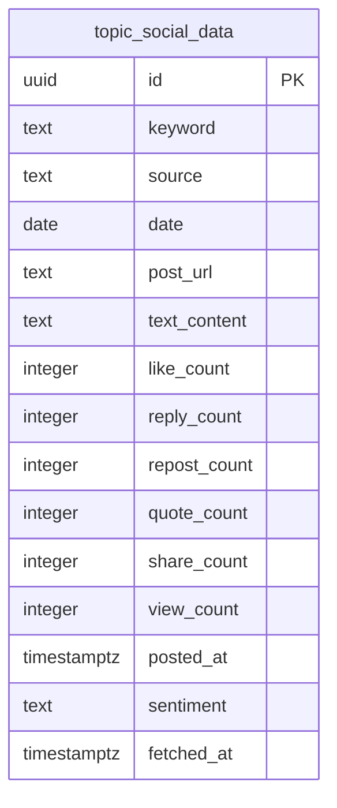

# Deep-crawl Threads — Database Schema

**Ngày:** 2026-08-23
**Trạng thái:** Đã deploy — migration 0004 đã apply lên production, `deep-crawl` job live-verified
**Thuộc:** chi tiết hoá phần data model của [2026-08-23-deep-crawl-threads-design.md](./2026-08-23-deep-crawl-threads-design.md), phản ánh đúng migration đã viết (`supabase/migrations/0004_add_topic_social_data.sql`), chưa phải bản đã chạy thật trên Supabase.

## Sơ đồ

Thêm 1 bảng mới — `topic_social_data` — bên cạnh `articles` (sub-project 1, xem [2026-08-20-rss-ingestion-database-schema.md](./2026-08-20-rss-ingestion-database-schema.md)) và `candidate_topics` (sub-project 2a, xem [2026-08-21-discovery-layer-database-schema.md](./2026-08-21-discovery-layer-database-schema.md)). `candidate_topics` không đổi schema ở sub-project này; `deep-crawl.ts` chỉ đọc từ nó (cột `is_shortlisted`/`keyword`/`category_hint`/`growth_rate`), không ghi thêm cột.

## Chi tiết cột

| Cột | Kiểu | Ràng buộc | Ghi chú |
|---|---|---|---|
| `id` | `uuid` | PK, `default gen_random_uuid()` | tự sinh, không truyền lúc insert |
| `keyword` | `text` | `not null` | lấy nguyên văn từ `candidate_topics.keyword` do `selectDeepCrawlTopics()` chọn ra, không chuẩn hoá lại thêm ở tầng này |
| `source` | `text` | `not null`, `check (source in ('threads'))` | v1 chỉ Threads — Facebook/TikTok deliberately ngoài phạm vi (xem design spec §7); cột vẫn để `text` + check thay vì hardcode literal, cùng pattern với `candidate_topics.source`, để mở rộng sau này chỉ cần đổi constraint |
| `date` | `date` | `not null` | ngày chạy deep-crawl (UTC calendar date, giống `candidate_topics.date`), dùng cho idempotency guard `hasDataForDate(date)` — xem Known gaps về ý nghĩa thật của guard này |
| `post_url` | `text` | `not null` | URL bài Threads, key dedup cùng `source`/`keyword` — xem ràng buộc `unique` bên dưới |
| `text_content` | `text` | `not null default ''` | nội dung bài viết; rỗng nếu Apify trả về giá trị sai kiểu (xem `toStringOrDefault()` ở `apify-threads-client.ts`) thay vì null, vì cột `not null` |
| `like_count` / `reply_count` / `repost_count` / `quote_count` / `share_count` / `view_count` | `integer` | nullable | 6 chỉ số engagement từ Apify actor; `null` nếu actor không trả về field đó hoặc trả sai kiểu (`toNumberOrNull()` validate runtime type thay vì ép kiểu bằng `as`, để 1 field sai kiểu không làm hỏng cả batch upsert — xem Known gaps ở doc thiết kế) |
| `posted_at` | `timestamptz` | nullable | thời điểm đăng bài theo Threads, `null` nếu actor không trả về hoặc trả sai kiểu |
| `sentiment` | `text` | nullable, `check (sentiment in ('positive','negative','neutral'))` | phân loại bởi `classify-sentiment.ts` (sub-project 3), thêm ở migration `0006`. `NULL` = chưa phân loại. Xem [schema doc sub-project 3](./2026-08-23-sentiment-engagement-metrics-database-schema.md) |
| `fetched_at` | `timestamptz` | `not null default now()` | thời điểm job `deep-crawl` ghi dòng này, KHÔNG tự cập nhật lại khi upsert đè lên dòng cũ (không có trigger `set_updated_at`, khác `articles`/`candidate_topics` — bảng này không có khái niệm "cập nhật", mỗi `post_url` coi như bất biến sau khi ghi lần đầu) |

Ràng buộc bổ sung: `unique (source, keyword, post_url)` — key dedup, `TopicSocialDataRepository.upsertPosts()` dùng `onConflict: 'source,keyword,post_url'`. Vì v1 chỉ có 1 `source` ('threads'), ràng buộc này trên thực tế tương đương `unique (keyword, post_url)` — giữ đủ 3 cột để nhất quán khi mở rộng thêm nguồn sau này.

## Index

- `topic_social_data_date_idx` — btree trên `date`, phục vụ `hasDataForDate(date)` (idempotency guard, đọc mỗi lần job `deep-crawl` chạy) và các query đọc theo ngày ở sub-project 3 (trend/share-of-voice) sau này.
- Ràng buộc `unique (source, keyword, post_url)` đồng thời đóng vai trò index hỗ trợ chính batch upsert trong `runDeepCrawl()` — mỗi lần gọi ghi tối đa 50 dòng/topic (sau dedupe theo `post_url`, xem Known gaps), đã dưới giới hạn "Max rows" mặc định của PostgREST nên không cần thêm safety-net riêng như `getTodayCandidates` ở `candidate_topics`.

## Row Level Security

`alter table topic_social_data enable row level security;` — **bật nhưng chưa có policy nào**, cùng trạng thái với `articles` và `candidate_topics` (xem [RSS ingestion schema doc](./2026-08-20-rss-ingestion-database-schema.md#row-level-security)). An toàn ở giai đoạn hiện tại vì toàn bộ ghi/đọc đều qua `service_role` key (bypass RLS) trong GitHub Actions; chặn hoàn toàn truy cập qua `anon`/`publishable` key cho tới khi có consumer thật (dashboard sub-project 4, nếu sau này thêm trang hiển thị dữ liệu Threads) cần thêm policy.

## Known gaps / limitations

- **Idempotency guard `hasDataForDate(date)` kiểm tra "đã có dữ liệu ghi hôm nay chưa", không phải "job đã chạy hôm nay chưa"** — nếu mọi topic trong 1 lần chạy đều lỗi/timeout và không có dòng nào được upsert, lần cron kế tiếp trong ngày sẽ chạy lại từ đầu và tốn lại ngân sách Apify cho đúng các topic đó. Đây là đánh đổi có chủ đích của thiết kế (self-healing, chấp nhận khả năng chi tiêu lại) — xem `runDeepCrawl()` ở `src/deep-crawl.ts`. Được giới hạn phần nào bởi `FETCH_TIMEOUT_MS` cố định (300s, khớp trần cắt phía server của Apify cho endpoint `run-sync-*`) ở `apify-threads-client.ts`, tránh trường hợp 1 request treo vô thời hạn rồi mới tính là "chạy xong không có dữ liệu".
- **Dedupe theo `post_url` trước khi upsert** (`runDeepCrawl()`, `new Map(posts.map((p) => [p.post_url, p])).values()`) — cần thiết vì mọi dòng trong batch của 1 topic đều cùng `(source, keyword)`, nên 1 `post_url` bị Apify trả trùng sẽ khiến 2 dòng đụng cùng 1 conflict key `unique(source,keyword,post_url)` trong cùng 1 câu lệnh upsert — Postgres từ chối toàn bộ câu lệnh ("ON CONFLICT DO UPDATE command cannot affect row a second time"), mất hết ~50 dòng của topic đó dù chi phí Apify đã trả. Cùng lớp lỗi đã gặp và fix ở `candidate_topics` (`GoogleTrendsSource` dedupe, xem discovery layer schema doc).
- **`maxTotalChargeUsd` (trần chi phí $0.5/lần gọi) chỉ là hard cap phía Apify cho 1 lần `searchByKeyword()`, không phải trần theo ngày/tháng** — trần ngân sách tổng ($39/tháng dự kiến) dựa trên giả định 8 topic/ngày × 1 lần/ngày, không có cơ chế enforce ở tầng code nếu job bị chạy lại nhiều lần ngoài dự kiến (vd nhiều `workflow_dispatch` thủ công liên tiếp trong cùng ngày) — idempotency guard ở trên là lớp bảo vệ chính cho việc này, không phải `maxTotalChargeUsd`.
- Không có cột `category_hint` copy từ `candidate_topics` — nếu sub-project 3 (trend/share-of-voice) cần lọc `topic_social_data` theo category, sẽ phải join ngược qua `(keyword, date)` sang `candidate_topics`, không có sẵn trong bảng này.
