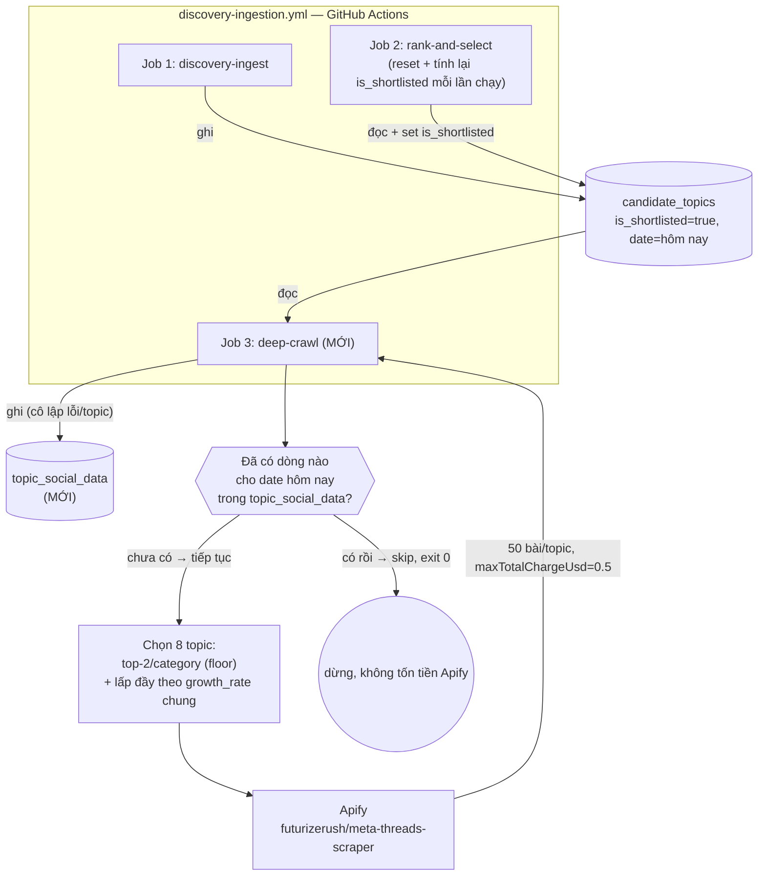

# Deep-crawl Threads — sub-project 2b (v1: Threads only)

**Ngày:** 2026-08-23
**Trạng thái:** Approved, chờ viết plan
**Thuộc:** lớp deep-crawl trong [2026-08-20-social-listening-architecture-design.md](./2026-08-20-social-listening-architecture-design.md) §2/§4 — phần "Apify / social media crawl ingestion" còn lại của sub-project 2 sau [discovery layer (2a)](./2026-08-21-discovery-layer-design.md).

## 1. Phạm vi

Chỉ **Threads**. Facebook và TikTok deliberately loại khỏi phạm vi v1 — xem §7.

Lý do thu hẹp: đo giá Apify thật (2026-08-23, xem §6 "Ngân sách") cho thấy chỉ riêng Threads ở quy mô mục tiêu đã gần/vượt trần $30/tháng gốc; Facebook qua thực nghiệm **không hỗ trợ tìm theo từ khóa** (actor chỉ nhận URL trang cụ thể — cần seed list Page/Group riêng, khác hẳn mô hình "shortlist → search" đang dùng) và **không ổn định theo từng trang** (thử 3 trang public lớn: 1 thành công, 2 thất bại). TikTok chưa đo giá thật.

## 2. Luồng dữ liệu



## 3. Schema: `topic_social_data`

| Cột | Kiểu | Ghi chú |
|---|---|---|
| `id` | uuid, PK | |
| `keyword` | text | khớp `candidate_topics.keyword` của ngày đó |
| `source` | text | `'threads'` (để mở rộng platform sau — không hard-code chỉ 1 giá trị) |
| `date` | text | ngày deep-crawl chạy (khớp `candidate_topics.date` nguồn) |
| `post_url` | text | |
| `text_content` | text | |
| `like_count`, `reply_count`, `repost_count`, `quote_count`, `share_count`, `view_count` | integer, nullable | engagement thô — chưa tính sentiment/trend (để dành sub-project 3) |
| `posted_at` | timestamptz | thời điểm bài viết gốc được đăng |
| `fetched_at` | timestamptz, default now() | |

Không lưu media/hashtag/mentions — actor trả về nhưng không dùng tới, giữ schema tối giản (YAGNI). Migration `0004_add_topic_social_data.sql`, index theo `date`, RLS bật không policy (theo đúng convention `articles`/`candidate_topics`).

## 4. Chọn topic mỗi ngày (per-category floor, tổng cứng 8)

Đọc `candidate_topics` nơi `is_shortlisted = true` và `date = hôm nay` — toàn bộ, không lọc theo nguồn discovery gốc (google_trends/youtube/rss không liên quan ở bước này, chỉ cần keyword + category_hint).

1. Với mỗi category (tai_chinh, giai_tri, du_lich): lấy top-2 theo `growth_rate` giảm dần trong category đó → tối đa 6 topic (reserve floor, đảm bảo mỗi sector dashboard có data social).
2. Dedup theo `keyword` (1 từ khóa có thể thuộc nhiều category, chỉ tính 1 lần).
3. Lấp đầy tới 8 slot bằng top `growth_rate` cao nhất trong **toàn bộ** shortlisted hôm đó (kể cả không category, kể cả đã tính ở bước 1 — dùng hết ngân sách/ngày).
4. Nếu tổng shortlisted < 8: deep-crawl hết số hiện có, không lỗi.

Khác với `rank-and-select.ts`: floor ở discovery layer là **cộng thêm, không giới hạn tổng**; ở đây phải **giới hạn cứng 8** vì ngân sách quyết định số lượng — floor + fill-remainder thay vì additive thuần túy.

## 5. Job & lịch chạy

Job thứ 3 `deep-crawl` thêm vào cuối `discovery-ingestion.yml`, `needs: [discovery-ingest, rank-and-select]`, `if: ${{ !cancelled() }}` (giống pattern `crawl-content` ở RSS ingestion workflow).

**Idempotency guard thay vì hard-code giờ chạy:** đầu job, check `topic_social_data` đã có dòng nào cho `date` hôm nay chưa — có thì skip (log, exit 0, không gọi Apify). Lý do chọn cách này thay vì "chỉ chạy ở lần cron cuối trong ngày":
- Không phụ thuộc số lần cron/ngày hay giờ cụ thể — không vỡ nếu sau này đổi lịch cron.
- An toàn với `workflow_dispatch` chạy tay nhiều lần cùng ngày (đã gặp thực tế trong phiên brainstorm này) — không tốn tiền Apify 2 lần cho cùng 1 ngày.
- Không nhất thiết chạy ở "lần cuối" — `rank-and-select` reset + tính lại `is_shortlisted` mỗi lần chạy, nên chạy ở bất kỳ lần nào trong ngày cũng lấy được shortlist hợp lệ tại thời điểm đó.

## 6. Gọi Apify

Client mới `src/lib/apify-threads-client.ts` (native `fetch`, cùng phong cách `youtube-search-client.ts` — không thêm SDK/npm dep), gọi endpoint đồng bộ (không cần tự poll run status):

```
POST https://api.apify.com/v2/acts/futurizerush~meta-threads-scraper/run-sync-get-dataset-items?token=...
Body: { mode: "search", keywords: [keyword], max_posts: 50, search_filter: "top", maxTotalChargeUsd: 0.5 }
```

- `maxTotalChargeUsd: 0.5` — trần an toàn cứng mỗi lần gọi. Chi phí thực đo (spike 2026-08-23): ~$0.0025-0.0035/bài + $0.005-$0.02/lần gọi ⇒ ~$0.195/topic ở quy mô 50 bài; trần $0.5 dư khoảng 2.5x, đủ chặn runaway cost nếu actor lỗi mà không chặn vận hành bình thường.
- `FETCH_TIMEOUT_MS = 120000` (dài hơn hẳn timeout 15s dùng cho các fetch khác trong project — actor thật chạy 20 bài mất ~1-2 phút qua đo thực tế, 50 bài dự kiến lâu hơn).
- Cô lập lỗi theo từng topic (try/catch quanh mỗi lần gọi actor — 1 topic lỗi không chặn 7 topic còn lại), đúng pattern lỗi-cô-lập đã dùng xuyên suốt RSS ingestion + discovery layer.

**Secret mới cần thêm vào GitHub Actions:** `APIFY_TOKEN` — user tự thêm (agent không có quyền set secret).

## 7. Ngân sách

Chốt cuối (2026-08-23, dựa số đo thật thay ước tính thô ban đầu): **8 topic/ngày × 50 bài/topic × 1 lần/ngày ≈ $39/tháng** — vượt trần $30/tháng gốc ~30%, người dùng đã chấp nhận đánh đổi để giữ được lượng dữ liệu/topic sâu hơn (tốt cho sentiment/share-of-voice ở sub-project 3 sau này) thay vì giữ đúng trần với ít dữ liệu hơn/topic.

Bảng phương án đã cân nhắc (giá đo thật, ~$0.003/bài + ~$0.01/lần gọi, 1 lần/ngày):

| Bài/topic | Topic/ngày | Chi phí/tháng |
|---|---|---|
| 20 | 12 | ~$25 |
| 50 | 8 | **~$39 (đã chọn)** |
| 50 | 12 | ~$58 |

## 8. Ngoài phạm vi (deliberately deferred)

- **Facebook**: cần seed list Page/Group riêng (không search theo keyword được) — mô hình khác hẳn Threads, xứng đáng 1 sub-project/spec riêng thay vì nhét chung. Actor `apify/facebook-posts-scraper` đã verify hoạt động (giá ~$0.005-$0.026/bài tùy tier) nhưng reliability không ổn định theo từng trang (2/3 trang test thất bại) — cần điều tra thêm trước khi thiết kế chính thức.
- **TikTok**: chưa đo giá/reliability thật trong spike này.
- **Sentiment analysis / trend-compute trên `topic_social_data`**: thuộc sub-project 3 (Trend / Share-of-voice computation), chưa brainstorm.
- **Dashboard hiển thị dữ liệu `topic_social_data`**: dashboard hiện tại (sub-project 4) chỉ đọc `candidate_topics`/`articles` — cần 1 vòng thiết kế riêng để thêm phần hiển thị social data.

## 9. Cấu trúc code

Theo đúng pattern đã dùng cho discovery layer (pure logic tách khỏi entrypoint I/O thật, TDD được):

- `src/lib/apify-threads-client.ts` — wrapper gọi Apify (I/O thuần, không unit test trực tiếp — giống `article-extractor.ts`/`youtube-search-client.ts`).
- `src/lib/topic-social-data-repository.ts` — interface + `SupabaseTopicSocialDataRepository` + `FakeTopicSocialDataRepository` (test double, giống `CandidateTopicRepository`).
- `src/deep-crawl.ts` — logic thuần: chọn 8 topic (§4), gọi client, map kết quả → rows, upsert. Nhận deps qua tham số/constructor để test bằng fake.
- `src/run-deep-crawl.ts` — entrypoint thật (wiring Supabase + Apify client thật), script `npm run deep-crawl`.
- Migration `supabase/migrations/0004_add_topic_social_data.sql`.
