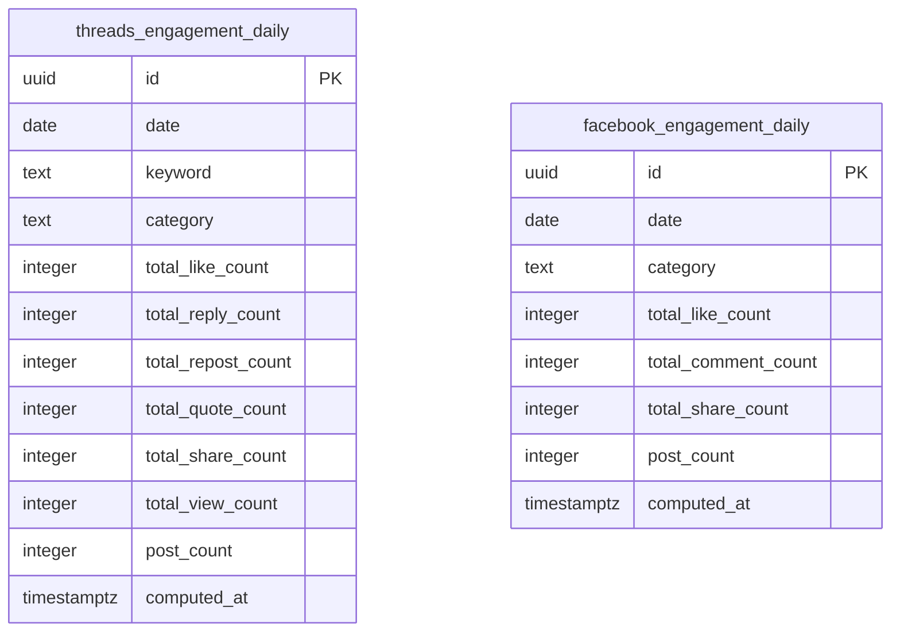

# Sentiment + Engagement Metrics — Database Schema

**Ngày:** 2026-08-23
**Trạng thái:** Chưa deploy — migration 0006 và 0007 chưa apply lên production
**Thuộc:** chi tiết hoá phần data model của [2026-08-23-sentiment-engagement-metrics-design.md](./2026-08-23-sentiment-engagement-metrics-design.md), phản ánh đúng 2 migration đã viết (`0006_add_sentiment_columns.sql`, `0007_add_engagement_daily_tables.sql`), chưa phải bản đã chạy thật trên Supabase.

## Sơ đồ

Migration 0006 thêm 1 cột (`sentiment`) vào 2 bảng đã có (`topic_social_data`, `facebook_page_data` — xem schema doc của [2b](./2026-08-23-deep-crawl-threads-database-schema.md)/[2c](./2026-08-23-deep-crawl-facebook-database-schema.md) để biết đầy đủ 2 bảng đó). Migration 0007 thêm 2 bảng mới hoàn toàn:

## Chi tiết cột — `threads_engagement_daily`

| Cột | Kiểu | Ràng buộc | Ghi chú |
|---|---|---|---|
| `id` | `uuid` | PK, `default gen_random_uuid()` | tự sinh |
| `date` | `date` | `not null` | ngày aggregate |
| `keyword` | `text` | `not null` | khớp `topic_social_data.keyword` |
| `category` | `text` | nullable | join ngược qua `candidate_topics(keyword, date)`, lấy `category_hint[0]`. `NULL` nếu không tìm thấy dòng `candidate_topics` khớp — xem Known gaps |
| `total_like_count` / `total_reply_count` / `total_repost_count` / `total_quote_count` / `total_share_count` / `total_view_count` | `integer` | `not null default 0` | tổng 6 cột engagement tương ứng của `topic_social_data`, `SUM` qua tất cả bài cùng `(date, keyword)` |
| `post_count` | `integer` | `not null default 0` | số bài được tính tổng |
| `computed_at` | `timestamptz` | `not null default now()` | thời điểm job `aggregate-engagement.ts` ghi/ghi đè dòng này |

Ràng buộc bổ sung: `unique (date, keyword)` — `ThreadsEngagementDailyRepository.upsertDaily()` dùng `onConflict: 'date,keyword'`. Mỗi lần job chạy, dòng cùng `(date, keyword)` bị **ghi đè hoàn toàn** (không cộng dồn) — xem thiết kế spec §3.3.

## Chi tiết cột — `facebook_engagement_daily`

| Cột | Kiểu | Ràng buộc | Ghi chú |
|---|---|---|---|
| `id` | `uuid` | PK, `default gen_random_uuid()` | tự sinh |
| `date` | `date` | `not null` | ngày aggregate |
| `category` | `text` | `not null`, `check (category in ('tai_chinh','giai_tri','du_lich'))` | Facebook đã có category natively từ seed list, không cần join |
| `total_like_count` / `total_comment_count` / `total_share_count` | `integer` | `not null default 0` | tổng 3 cột engagement tương ứng của `facebook_page_data`, `SUM` qua tất cả bài cùng `(date, category)` |
| `post_count` | `integer` | `not null default 0` | số bài được tính tổng |
| `computed_at` | `timestamptz` | `not null default now()` | thời điểm job ghi/ghi đè dòng này |

Ràng buộc bổ sung: `unique (date, category)` — `onConflict: 'date,category'`.

## Index

- `threads_engagement_daily_date_idx` / `facebook_engagement_daily_date_idx` — btree trên `date`, phục vụ query đọc theo ngày (dashboard, nếu sau này cần).

## Row Level Security

Cả 2 bảng bật RLS không policy, cùng trạng thái với mọi bảng khác trong project — an toàn vì toàn bộ ghi/đọc đều qua `service_role` key trong GitHub Actions.

## Known gaps / limitations

- **`threads_engagement_daily.category` chỉ lấy `category_hint[0]`** — nếu 1 keyword thuộc nhiều category (`category_hint` có >1 phần tử), phần tử còn lại bị bỏ qua hoàn toàn ở bảng này (không nhân bản dòng theo từng category như share-of-voice ở dashboard đã làm) — simplification chấp nhận được cho v1, xem lại nếu cần chính xác hơn.
- **`category = NULL` nếu không tìm thấy `candidate_topics` khớp `(keyword, date)`** — có thể xảy ra nếu dữ liệu `candidate_topics` bị dọn/archive khác lịch với `topic_social_data`. Không coi là lỗi, chỉ là category chưa xác định được.
- **Ghi đè hoàn toàn mỗi lần chạy, không phải cộng dồn** — nếu `aggregate-engagement.ts` chạy 2 lần/ngày và dữ liệu nguồn (`topic_social_data`/`facebook_page_data`) không đổi giữa 2 lần, kết quả giống hệt nhau (idempotent theo nghĩa "cùng input → cùng output", khác với sentiment job vốn idempotent theo nghĩa "chỉ xử lý phần chưa làm").
