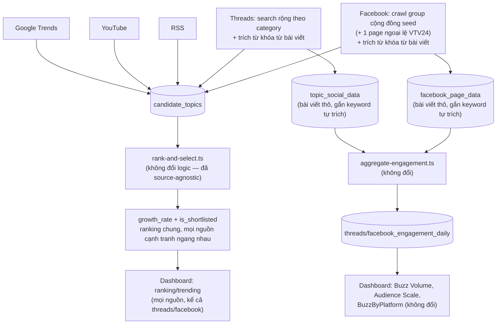

# Apify discovery redesign — Threads/Facebook trở thành nguồn discovery độc lập

**Ngày:** 2026-09-04
**Trạng thái:** Approved, chờ viết plan
**Thay thế/sửa đổi:** [2026-08-23-deep-crawl-threads-design.md](./2026-08-23-deep-crawl-threads-design.md) (§4 chọn topic, §7 ngân sách), sub-project 2c (Facebook: đổi hẳn seed list + actor, từ trang thương hiệu sang group cộng đồng — xem §5), sub-project 3 phần 1 (sentiment classification — loại bỏ).

## 1. Vấn đề

Thiết kế cũ: Apify (Threads + Facebook) chỉ **đào sâu** những từ khóa mà tầng discovery miễn phí (Google Trends/YouTube/RSS) đã tự chọn sẵn (8 từ khóa/ngày cho Threads, theo growth_rate). Hệ quả:

- **Trending score/ranking không hề dùng dữ liệu Apify** — 100% từ `growth_rate` của tầng discovery miễn phí. Apify chỉ tô điểm thêm (sentiment badge, Facebook summary card) cho ĐÚNG 8 từ khóa/ngày đó.
- Một từ khóa xếp hạng cao (do growth_rate thật) hoàn toàn có thể **không nằm trong 8 từ khóa được chọn crawl** hôm đó → trang Topic Detail của nó trống trơn về sentiment/engagement — không phải bug, mà là hệ quả tất yếu của kiến trúc "enrichment cho tập con nhỏ", trong khi ranking lại hiển thị đều cho toàn bộ danh sách.
- Sentiment coverage vì vậy vừa mỏng vừa không đồng đều — có topic có sentiment, có topic không, không phản ánh được gì có hệ thống về "bức tranh tổng quan".

## 2. Quyết định thiết kế chính

1. **Apify (Threads + Facebook) trở thành nguồn discovery độc lập thứ 4 và thứ 5**, ngang hàng Google Trends/YouTube/RSS — tự sinh `candidate_topics` với `metric_value`/`growth_rate` riêng, KHÔNG còn là bước "đào sâu" cho từ khóa nguồn khác chọn sẵn.
2. **Bỏ hẳn cơ chế "chọn N từ khóa để deep-crawl"** (`select-deep-crawl-topics.ts` xoá hoàn toàn) — không còn khái niệm crawl theo yêu cầu của nguồn khác.
3. **Threads đổi từ search-theo-keyword-cụ-thể sang search-rộng-theo-category** + trích từ khóa từ nội dung bài viết thật (bigram extraction, tái dùng `keyword-extractor.ts` đang dùng cho YouTube).
4. **Facebook đổi từ crawl-trang-thương-hiệu sang crawl-group-cộng-đồng thật** (actor mới `apify/facebook-groups-scraper`, thay `apify/facebook-posts-scraper`) — lý do đổi: khảo sát lại 6 trang seed cũ phát hiện 3/6 trùng đúng publisher đã có trong RSS (`cafef.vn`, `vneconomy.vn`, `kenh14` — xem `config/sources.config.ts`), và cả 6 đều là trang thương hiệu/công ty chính thức, không phải nơi người dùng thật thảo luận — cùng bản chất "tiếng nói chính thức" như RSS, không bổ sung tín hiệu xã hội thật nào. Facebook **không có search-theo-keyword** (đã verify: 2 actor search khác nhau đều trả kết quả không liên quan gì tới query, nhiều khả năng cùng chung 1 nguồn dữ liệu kém tin cậy phía sau) — nên áp dụng cơ chế seed-list cố định như cũ, nhưng seed là **group cộng đồng thảo luận thật** thay vì trang thương hiệu, rồi trích từ khóa từ nội dung bài, y hệt cơ chế Threads. Ngoại lệ: giữ lại đúng 1 Page (VTV24, theo yêu cầu người dùng) — xem §5.1b.
5. **Bỏ hẳn sentiment classification** (`run-classify-sentiment.ts`, `openai-sentiment-classifier.ts`, cột `sentiment` trên `topic_social_data`/`facebook_page_data`) — không còn phân loại sentiment cho bất kỳ bài viết nào.
6. **Giữ nguyên `aggregate-engagement.ts`** và 2 bảng `threads_engagement_daily`/`facebook_engagement_daily` — độc lập hoàn toàn với sentiment, chỉ đọc từ dữ liệu bài viết thô, nuôi các KPI Buzz Volume/Audience Scale hiện có trên dashboard. Không đổi gì ở đây.
7. **`rank-and-select.ts` không cần sửa logic** — vòng lặp tính growth_rate theo baseline 7 ngày đã tổng quát cho mọi source (chỉ trừ đặc cách `google_trends`); chỉ cần mở rộng type `CandidateTopic['source']` và check constraint DB.
8. **Dashboard: bỏ mọi UI sentiment** (badge trên hot-topics, `SentimentByCategorySection`, `SentimentTrendChart`, 3 dòng `SentimentBar` trong `FacebookSummarySection`, tooltip liên quan), **giữ nguyên mọi UI engagement** (dòng tiêu đề "X bài · Y tương tác" trong `FacebookSummarySection`, `BuzzByPlatformSection`, các KPI card).

## 3. Luồng dữ liệu mới



## 4. Threads — search rộng theo category

Bỏ bước "đọc `candidate_topics.is_shortlisted` → chọn 8 keyword". Thay bằng vòng lặp cố định qua 3 category × 2 query rộng/category = 6 lần gọi Apify/ngày:

```typescript
export const THREADS_DISCOVERY_QUERIES: Record<Category, string[]> = {
  tai_chinh: ['chứng khoán', 'ngân hàng'],
  giai_tri: ['showbiz', 'phim chiếu rạp'],
  du_lich: ['du lịch', 'vé máy bay'],
};
```

Giống comment trong `facebook-seed-pages.ts`: đây là danh sách cố định, sửa được không cần đổi kiến trúc (chỉnh sửa từng lúc nếu query cho ra kết quả lệch category).

Với mỗi `(category, query)`:
1. Gọi `client.searchByKeyword(query)` — client hiện có (`apify-threads-client.ts`), không đổi actor/mode, vẫn `max_posts: 50`, `maxTotalChargeUsd: 0.5`.
2. Với mỗi bài trả về, chạy `extractKeywords(post.text_content)` (bigram, tái dùng `keyword-extractor.ts`).
3. Cộng dồn engagement (`ThreadsPost`: `like_count + reply_count + repost_count + quote_count + share_count`, coi null là 0 — không cộng `view_count`, vì không phải mọi bài đều có view_count khác null) theo từng từ khóa trích được trong toàn bộ batch của `(category, query)` đó — thành `metric_value`, y hệt pattern `aggregateYouTubeKeywords` cộng `viewCount`.
4. Kết quả → `RawCandidate[]` (`source: 'threads'`, `category_hint: [category]`) → ghi `candidate_topics` qua repository hiện có (không đổi).
5. Bài viết thô vẫn upsert vào `topic_social_data`, nhưng `keyword` giờ là từ khóa **tự trích** (một bài có thể sinh ra 2-3 từ khóa bigram khác nhau → có thể tạo nhiều hơn 1 row cho cùng `post_url` dưới các `keyword` khác nhau — hợp lệ với unique constraint hiện tại `(source, keyword, post_url)`, đã được thiết kế cho khả năng này từ trước).

Idempotency guard (`hasDataForDate`) giữ nguyên — vẫn chạy đúng 1 lần/ngày dù cron 3 lần/ngày.

## 5. Facebook — đổi seed list sang group cộng đồng + trích từ khóa

### 5.1 Seed list mới (đã verify sống + đúng chủ đề bằng lời gọi Apify thật, 2026-09-04)

```typescript
export const FACEBOOK_SEED_GROUPS: FacebookSeedGroup[] = [
  { url: 'https://www.facebook.com/groups/1978945002151603/', category: 'tai_chinh' }, // Cộng Đồng Chứng Khoán Việt Nam
  { url: 'https://www.facebook.com/groups/vnsic89/', category: 'tai_chinh' },          // VNSIC - Cộng Đồng Đầu Tư Chứng Khoán
  { url: 'https://www.facebook.com/groups/honghotshowbiz/', category: 'giai_tri' },    // Hóng hớt showbiz - 8 chuyện thiên hạ
  { url: 'https://www.facebook.com/groups/phuotluon/', category: 'du_lich' },          // Phượt Luôn
  { url: 'https://www.facebook.com/groups/YAN.VietNamOi/', category: 'du_lich' },      // Việt Nam Ơi (group)
];
```

`giai_tri` chỉ có 1 group verify sống (`honghotshowbiz`) — group thứ 2 test được (`bimatshowbiz`, 1.2 triệu thành viên) trả về lỗi `not_available` (nhóm bị khoá — có báo VN đưa tin việc này xảy ra hàng loạt với nhiều group lớn cùng lúc, không phải lỗi thao tác). Cần tìm thêm ít nhất 1 group giai_tri dự phòng trước khi plan chạy thật, theo đúng tinh thần over-provision của seed list gốc (2/category) — chưa tìm được ứng viên thứ 2 phù hợp trong phiên brainstorm này.

`du_lich` chỉ 2 group (không thêm page) — 2 trang lữ hành cũ (vietravel, klook.vietnam) bị loại hẳn, không thay bằng page nào khác cho category này (khác với tai_chinh, xem §5.1b).

**Vì sao đổi từ 6 trang thương hiệu sang 5 group cộng đồng:** trang thương hiệu (cafef.vn, kenh14, vietravel...) chỉ đăng lại nội dung chính thức — 3/6 trang cũ trùng thẳng publisher đã có trong RSS, không sinh từ khóa mới nào. Group cộng đồng thật (test trực tiếp bằng Apify, không đoán): trả về bài viết + bình luận của thành viên thật, đúng chủ đề category, có engagement thật (vd. group Phượt Luôn: 33 like/8 comment cho 1 bài review điểm đến) — đúng loại tín hiệu "xã hội" mà RSS không có.

### 5.1b Ngoại lệ: 1 Page bổ sung cho tai_chinh (VTV24)

Theo yêu cầu người dùng — chấp nhận đánh đổi để lấy nguồn có lượng tiếp cận lớn (4.7 triệu likes) dù không phải group cộng đồng:

```typescript
export const FACEBOOK_SEED_PAGES: FacebookSeedPage[] = [
  { url: 'https://www.facebook.com/tintucvtv24/', category: 'tai_chinh' }, // Trung tâm Tin tức VTV24
];
```

Đã verify sống + gọi thật `apify/facebook-posts-scraper` (actor Page cũ — **không xoá** như bản spec trước dự định, xem §5.2b): 5 bài mẫu trả về thật, nhưng chỉ 1/5 liên quan tài chính/thuế — phần còn lại là tin thời sự/đời sống chung (VTV24 là kênh tin tức tổng hợp, không chuyên tài chính). Khác hẳn 5 group ở §5.1 — đây **không phải** "cộng đồng thảo luận", mà là trang chính thức của đài truyền hình quốc gia, cùng loại nguồn đã bị loại ở §2 điểm 4 (lý do: không sinh tín hiệu xã hội thật). Chấp nhận vì người dùng đã xác nhận muốn giữ, biết rõ đánh đổi — từ khóa trích từ page này sẽ lẫn cả tin không-tài-chính, không phải bug khi triển khai.

### 5.2a Actor mới: `apify/facebook-groups-scraper` (cho 5 group §5.1)

Thay `apify/facebook-posts-scraper` (chỉ nhận Page URL, không đọc được Group). Input/response đã verify thật qua `run-sync-get-dataset-items`:

```
POST https://api.apify.com/v2/acts/apify~facebook-groups-scraper/run-sync-get-dataset-items?token=...&maxTotalChargeUsd=0.1
Body: { startUrls: [{ url: groupUrl }], resultsLimit: 50, maxTotalChargeUsd: 0.1 }
```

`FacebookPost` interface đổi field theo response thật (khác hẳn actor cũ):

```typescript
export interface FacebookGroupPost {
  post_url: string;      // item.url
  text_content: string;  // item.text — có thể rỗng (bài chia sẻ ảnh/video không caption, item.sharedPost) — lọc bỏ trước khi extractKeywords
  like_count: number | null;    // item.likesCount
  comment_count: number | null; // item.commentsCount
  share_count: number | null;   // item.sharesCount
  posted_at: string | null;     // item.time
}
```

Một số bài trả về `error: "not_available"` ở cấp item thay vì object bài viết bình thường (không chỉ ở cấp group — xem §5.1) — lọc theo `typeof item.url === 'string'`, giống pattern lọc hiện có trong `apify-facebook-client.ts`.

### 5.2b Actor cũ giữ lại: `apify/facebook-posts-scraper` (chỉ cho VTV24 §5.1b)

Bản spec trước dự định xoá hẳn `src/lib/apify-facebook-client.ts` — **giữ lại**, vì VTV24 là Page, không phải Group. Đã gọi thật để verify field response (trước đây `apify-facebook-client.ts` chỉ ghi "best-effort guesses, chưa verify" — giờ xác nhận đúng):

```typescript
export interface FacebookPost {
  post_url: string;              // item.url
  text_content: string;          // item.text
  like_count: number | null;     // item.likes
  comment_count: number | null;  // item.comments — VẮNG MẶT ở bài dạng "reel"/video, không chỉ là 0 — dùng toNumberOrNull hiện có (đã xử lý đúng, coi undefined → null)
  share_count: number | null;    // item.shares
  posted_at: string | null;      // item.time
}
```

Không đổi field mapping/code của `apify-facebook-client.ts` — chỉ đổi comment ghi chú "unverified" thành "verified 2026-09-04" và xoá `FACEBOOK_SEED_PAGES` cũ (6 trang) để thay bằng bản mới chỉ có VTV24 (§5.1b).

### 5.3 Luồng xử lý (song song với Threads §4)

Với mỗi group trong `FACEBOOK_SEED_GROUPS` (actor §5.2a) và page trong `FACEBOOK_SEED_PAGES` (actor §5.2b — hiện chỉ có VTV24):
1. Gọi actor tương ứng, lấy tối đa 50 bài/group/ngày (group) hoặc giữ nguyên `MAX_POSTS_PER_PAGE = 15`/ngày (page, không đổi từ thiết kế cũ).
2. Lọc bỏ bài có `text_content` rỗng hoặc `error`.
3. `extractKeywords(post.text_content)` trên từng bài còn lại.
4. Cộng dồn engagement (group: `like_count + comment_count + share_count`; page: cùng công thức, field đã map ở §5.2b — coi null là 0) theo từ khóa trích được, `category` = category có sẵn của seed (`FacebookSeedGroup.category`/`FacebookSeedPage.category` — biết chắc từ seed list, không cần đoán).
5. Ghi `candidate_topics` (`source: 'facebook'`) — cả group lẫn page đều ghi vào cùng source, không phân biệt ở tầng ranking.
6. Bài viết thô upsert vào `facebook_page_data`, `keyword` là từ khóa tự trích (như Threads §4 bước 5).

Bỏ lời gọi sentiment — job riêng `run-classify-sentiment.ts` bị xoá hoàn toàn (§2 điểm 5), không cần sửa gì trong `deep-crawl-facebook.ts` để "bỏ" sentiment vì nó chưa từng gọi trực tiếp ở đây.

## 6. Schema / migration

```sql
-- Mở rộng nguồn hợp lệ cho candidate_topics
alter table candidate_topics drop constraint candidate_topics_source_check;
alter table candidate_topics add constraint candidate_topics_source_check
  check (source in ('google_trends', 'youtube', 'rss', 'threads', 'facebook'));

-- Bỏ sentiment (cột, không phải bảng riêng)
alter table topic_social_data drop column sentiment;
alter table facebook_page_data drop column sentiment;
```

`topic_social_data.source` check constraint (`'threads'` only) không cần đổi — Facebook đã có bảng riêng `facebook_page_data` từ trước, không đi qua `topic_social_data`.

`CandidateTopic['source']` (dùng ở cả `src/types.ts` và `dashboard/lib/types.ts`) mở rộng từ `'google_trends' | 'youtube' | 'rss'` thành thêm `'threads' | 'facebook'`. Đây là thay đổi type lan ra nhiều nơi dùng exhaustive switch/Record theo source (`SOURCE_LABELS`, `groupBySource`, `flattenAndRankHotTopics`'s `bySource` param) — plan cần liệt kê từng chỗ.

## 7. Ngân sách

| Nguồn | Trước | Sau |
|---|---|---|
| Threads | 8 keyword/ngày × 50 bài (~$0.195/call) ≈ **$39/tháng** | 6 query/ngày (3 category × 2) × 50 bài ≈ **$35/tháng** |
| Facebook (group) | 6 trang/ngày, ~$0.005-0.026/bài, biến động tới ~$70/tháng worst-case | `apify/facebook-groups-scraper`, pay-per-event ~$0.0026/bài (verify thật §5.2a) — 5 group × 50 bài/ngày = 250 bài/ngày ≈ **~$20/tháng** |
| Facebook (page, VTV24) | *(mới, không có trước)* | `apify/facebook-posts-scraper`, ~$0.005-0.026/bài (mức cũ từ 2c, không đổi) × 15 bài/ngày ≈ **~$2-12/tháng** |

Tổng ngân sách **vẫn giảm hoặc tương đương** so với trước (~$59-109/tháng gộp 2 platform trước → ~$57-67/tháng sau, tuỳ mức phí thật của VTV24), dù dữ liệu chất lượng cao hơn hẳn cho phần group (nội dung đúng chủ đề, thay vì trùng RSS/không liên quan) — riêng VTV24 chấp nhận lẫn tin không-tài-chính, xem §5.1b.

## 8. Dashboard — dọn UI sentiment, giữ UI engagement

**Xoá:**
- Badge sentiment trên hot-topics (`sentimentBadgeClass`/`formatSentimentBadge` trong `hot-topic-format.ts` và nơi gọi)
- `SentimentByCategorySection.tsx`, `sentiment-by-category.ts`
- `SentimentTrendChart.tsx`, `sentiment-trend.ts`, panel tương ứng trên `/analytics`
- 3 dòng `<SentimentBar>` + nhánh `"Chưa phân loại sentiment"` trong `FacebookSummarySection.tsx` (dòng tiêu đề "X bài · Y tương tác" **giữ nguyên** — đó là engagement thật, không phải sentiment)
- Sentiment ở Topic Detail (`/topic/[keyword]`)
- Các key sentiment-related trong `metric-tooltips.ts` + mô tả liên quan trong `/help`

**Giữ nguyên:** mọi KPI/section dựa trên engagement (`BuzzByPlatformSection`, Buzz Volume, Audience Scale, Share of Voice, Buzz Trend chart) — các thứ này đọc từ `threads/facebook_engagement_daily`, không đụng tới sentiment.

## 9. Ngoài phạm vi (deliberately deferred)

- Đổi/tinh chỉnh danh sách query Threads hoặc group seed Facebook sau khi có dữ liệu thật (điều chỉnh không cần đổi kiến trúc, xem §4/§5).
- Tìm group giai_tri thứ 2 cho `FACEBOOK_SEED_GROUPS` (§5.1 ghi rõ hiện chỉ có 1, cần thêm trước khi plan chạy thật để đạt over-provision 2/category).
- TikTok — vẫn ngoài phạm vi như spec 2b gốc.
- Xoá hẳn 2 bảng sentiment cũ nếu có (không có — sentiment chỉ là cột trên 2 bảng đã tồn tại, xử lý bằng `drop column` ở §6, không cần drop table).

## 10. Cấu trúc code (thay đổi/xoá)

- Xoá: `src/lib/select-deep-crawl-topics.ts` (+ test), `src/run-classify-sentiment.ts`, `src/lib/openai-sentiment-classifier.ts` (+ test), job `classify-sentiment` trong `discovery-ingestion.yml`.
- Mới: `src/lib/threads-discovery-queries.ts` (hằng số §4), `src/lib/facebook-seed-groups.ts` (hằng số §5.1, `FACEBOOK_SEED_GROUPS`), `src/lib/apify-facebook-groups-client.ts` (client mới, gọi `apify/facebook-groups-scraper` — field mapping §5.2a), `src/lib/aggregate-threads-keywords.ts` (logic trích + cộng dồn, tương tự `aggregate-youtube-keywords.ts`), `src/lib/aggregate-facebook-keywords.ts` (tương tự, dùng chung cho cả group lẫn page — nhận `FacebookPost[]` bất kể nguồn).
- Sửa (KHÔNG xoá): `src/lib/facebook-seed-pages.ts` — thay nội dung `FACEBOOK_SEED_PAGES` từ 6 trang cũ thành chỉ VTV24 (§5.1b); `src/lib/apify-facebook-client.ts` — giữ nguyên field mapping (đã verify đúng §5.2b), chỉ cập nhật comment "unverified" → "verified 2026-09-04".
- Sửa: `src/deep-crawl.ts` (bỏ chọn-8-topic, lặp qua `THREADS_DISCOVERY_QUERIES`), `src/deep-crawl-facebook.ts` (gọi cả 2 client — group + page, thêm bước trích từ khóa cho cả 2, bỏ nhánh gọi sentiment nếu có), `src/types.ts` + `dashboard/lib/types.ts` (mở rộng `CandidateTopic['source']`), mọi `Record<CandidateTopic['source'], ...>`/switch exhaustive trong dashboard (`hot-topics.ts`'s `groupBySource`, `hot-topic-format.ts`'s `SOURCE_LABELS`, `trending.ts`'s `flattenAndRankHotTopics` param type, v.v. — plan liệt kê đủ).
- Migration mới: `supabase/migrations/000N_apify_discovery_redesign.sql` (nội dung §6).
- Dashboard: xoá các file/đoạn liệt kê ở §8.
